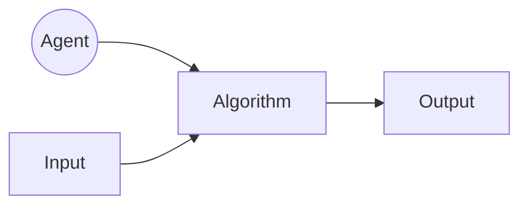
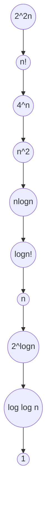

# AlgorithmDesignAndAnalysis

<h1> 1. The Analysis Framework</h1>
<ul>
<h3> <i><ins>A.Time Efficiency:</ins></i> It is also called <i><ins>Time Complexity </ins></i>,It indicates how fast an algorithm runs .</h3>
<h3> <i><ins>B.Space Efficiency:</ins></i> It is also called <i><ins>Space Complexity</ins></i>, refers to amount of memory units required by the algorithm in addition to the space needed for its input and output .</h3>
<ul>
<li><h3> <a href="https://github.com/AvinandanBose/AlgorithmDesignAndAnalysis/blob/main/1.The%20Analysis%20Framework.pdf">1.The Analysis Framework Doc</h3></li>
</ul>
</ul>
<h1> 2. Overview Of Algorithms</h1>
<ul>




<h3> <i><ins>A. Agent:</ins></i> It can be a human or a computer, is the performer. An agent is just something that acts. In terms of computer: Computer operate autonomously, perceive their environment, persist over a prolonged period, adapt to change, and create and pursue goals. A rational agent is one that acts so as to achieve the best outcome or, when there is uncertainty, the best outcome. .</h3>


<h3> <i><ins>B.Algorithm:</ins></i> An algorithm is a sequence of unambiguous for solving a problem, i.e., for obtaining a required output for any legitimate input in a finite amount of time. Algorithm refers to the steps to be carried out in order to accomplish a particular task .</h3>


<h3> Three things to be considered while writing algorithm:<i><ins>Input</ins></i>, <i><ins>process</ins></i>, and <i><ins>output</ins></i>.The input that we give to an algorithm is processed with the of the procedure and finally returns the output. </h3>

<li><h3> <a href="https://github.com/AvinandanBose/AlgorithmDesignAndAnalysis/blob/main/2.Overview%20Of%20Algorithms.pdf">2. Overview Of Algorithms Doc</h3></li> 

<h3><i>Examples : </i></h3>
<ul>
<li><h3>1. Euclid's Algorithm To Find Greatest Common Digit(GCD).</h3></li> 

```Syntax

//English Like Algorithm
Euclid's algorithm for computing GCD(m,n)

Step 1: If n = 0 , return the value of m as the answer and stop; otherwise proceed to Step 2.
Step 2: Divide m by n and assign the value of the remainder to r.
Step 3: Assign the value of n to m and the value to r to n . Go to Step 1.

//Pseudo Code

Euclid (m,n)
//Computes gcd(m,n) by Euclid's algorithm
//Input: Two nonnegative, not both zero integers m and n
//Output: Greatest Common Divisor of m and n

while n ≠ do
  r ← m mod n
  m ← n
  n ← r


```
<li><h3> <a href="https://github.com/AvinandanBose/AlgorithmDesignAndAnalysis/blob/main/2.a.Euclid's%20Algorithm%20for%20computing%20gcd(m%2Cn).pdf"> Euclid's Algorithm To Find Greatest Common Digit(GCD) - Algorithm</h3></li>

<li><h3> <a href="https://github.com/AvinandanBose/JavaClassicalDataStructure/blob/main/Euclid.java">Euclid’s Algorithm To Find GCD(m,n) in Java Program</a></h3></li>


</ul>


</ul>

<h1> 3. Ways of Writing an Algorithm</h1>
<ul>
<h3> There are various ways of writing an algorithm. </h3>
    <ul>
        <li><h3> 1.<ins>English-Like Algorithm</ins></h3></li> 
        <ul>
            <h3><i><ins>Eg:</ins></i></h3>
            
```Syntax

Algorithm : English – like algorithm of linear search.
	
Step 1: Compare `item` with the first element of the array, A.
Step 2: If the two are same, then print the position of the element and exit.
Step 3: Else repeat the above process with the rest of the elements.
Step 4: If the item is not found at any position, then print ‘not found’ and exit.

```

<h3> Disadvantage:</h3>
<ul>
<li><h3> 1.Natural Languages can be ambiguous and therefore its lack the characteristics of being definite.</h3></li> 
<li><h3> 2.English language-like algorithms are not considered good for most of the task.</h3></li> 
</ul>
            
</ul>

<li><h3> 2.<ins>Flow Chart</ins></h3></li> 
<ul>
<h3> Flowcharts pictorially depict a process. They are easy to understand and are commonly used in the case of simple problems.</h3> 
</ul>
<li><h3> 3.<ins>Pseudo-code.</ins></h3></li> 
<ul>
<h3>An artificial and informal language constituting of notations helps in resembling a simplified programming language, used in program design. This way of writing algorithm is most acceptable and most widely used.</h3> 
</ul>
</ul>
<ul>
<li><h3> <a href="https://github.com/AvinandanBose/AlgorithmDesignAndAnalysis/blob/main/3.Ways%20of%20Writing%20An%20Algorithm.pdf">3. Ways Of Writing Algorithms Doc[with Full Description]</h3></li> 

</ul>
</ul>
<h1> 3. Some Mathematical Concepts</h1>
<ul>
<h3> Prior going with the analysing part of the Programming concept , one must have clear understanding  on :</h3>
<ul>
.....
</ul>


</ul>

<h1> 4. Rate of Growth</h1>
<ul>

<h3>The <i>Rate Of Growth</i> helps to find the behavior of an Algorithm. The rate at which the running time increases as a function of input is called <i>Rate Of Growth</i>.The <i>Rate Of Growth Of An Algorithm</i> is the rate at which its running time increases as a function of input <i>‘n’</i>. </h3>
<ul>
 <h3><li><a href="https://github.com/AvinandanBose/AlgorithmDesignAndAnalysis/blob/main/Rate%20of%20Growth.pdf"> Rate of Growth -In Details</li></h3>
</ul>


</ul>

<h1> 5.Algorithm Classes / Commonly Used Rates of Growth</h1>
<ul>

<Table>
<tr>
<th>Function Name</th>
<th>Name used for algorithm analysis</th>
<th>Remarks</th>	
</tr>
	
<tr>
<td> c</td>
<td>Constant Algorithm</td>
<td>These algorithms are independent of the input.</td>	
</tr>
	
<tr>
<td> Log log N</td>
<td>Log log⁡ function</td>
<td>Logarithmic algorithms are preferred, as their growth is always low.</td>	
</tr>
	
	
<tr>
<td> Log N</td>
<td>logarithmic</td>
<td>These are very optimal algorithms.</td>	
</tr>
	
<tr>
<td> Log^2 N</td>
<td>Log-squared</td>
<td>These are optimal algorithms.</td>	
</tr>
	
<tr>
<td> N</td>
<td>Linear algorithm</td>
<td>Linear algorithms are preferred, e.g., summing of an array.</td>	
</tr>
	
<tr>
<td> N^2</td>
<td>Quadratic</td>
<td>Sorting algorithms are preferred, e.g., bubble sort, selection sort.</td>	
</tr>
	
<tr>
<td> N^3</td>
<td>Cubic</td>
<td>Matrix multiplication is preferred.</td>	
</tr>
	
<tr>
<td> N^k</td>
<td>Polynomial</td>
<td>Polynomial algorithms of lesser order k are preferred.</td>	
</tr>
	
<tr>
<td> a^n</td>
<td>Exponential</td>
<td>Here a is constant, and intractable algorithms are exponential.</td>	
</tr>
	
<tr>
<td> N!</td>
<td>Factorial</td>
<td>These algorithms are intractable.</td>	
</tr>
	
	
	
</Table>
	
 <h3><li><a href="https://github.com/AvinandanBose/AlgorithmDesignAndAnalysis/blob/main/5.Comparison%20Framework.pdf"> Algorithm Classes / Commonly Used Rates of Growth</li></h3>
</ul>

<h1> 6.RELATIONSHIP BETWEEN DIFFERENT RATES OF GROWTH</h1>

<ul>




<h3 align="Center"> <i> The above Diagram shows decreasing rates of growth. </i></h3>

<h3> <li><a href="https://github.com/AvinandanBose/AlgorithmDesignAndAnalysis/blob/main/6.Relationship%20between%20different%20rates%20of%20growth.pdf"> Relationship between different rates of growth - In Details </a> </li></h3>

</ul>
