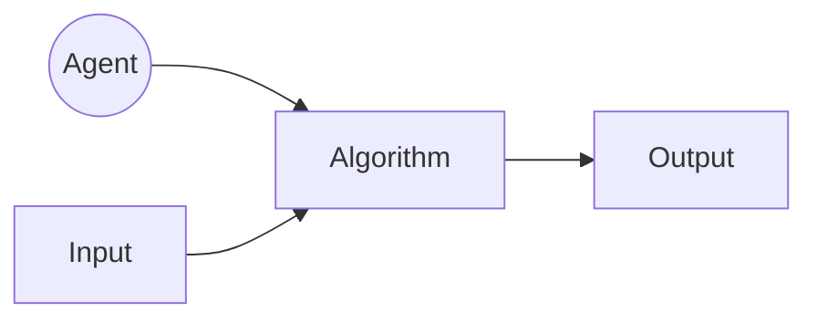
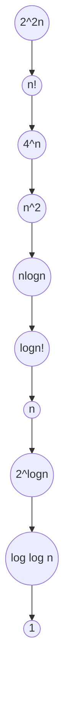

# AlgorithmDesignAndAnalysis

<h1> 1. The Analysis Framework</h1>
<ul>
<h3> <i><ins>A.Time Efficiency:</ins></i> It is also called <i><ins>Time Complexity </ins></i>,It indicates how fast an algorithm runs .</h3>
<h3> <i><ins>B.Space Efficiency:</ins></i> It is also called <i><ins>Space Complexity</ins></i>, refers to amount of memory units required by the algorithm in addition to the space needed for its input and output .</h3>
<ul>
<li><h3> <a href="https://github.com/AvinandanBose/AlgorithmDesignAndAnalysis/blob/main/1.The%20Analysis%20Framework.pdf">1.The Analysis Framework Doc</h3></li>
</ul>
</ul>
<h1> 2. Overview Of Algorithms</h1>
<ul>




<h3> <i><ins>A. Agent:</ins></i> It can be a human or a computer, is the performer. An agent is just something that acts. In terms of computer: Computer operate autonomously, perceive their environment, persist over a prolonged period, adapt to change, and create and pursue goals. A rational agent is one that acts so as to achieve the best outcome or, when there is uncertainty, the best outcome. .</h3>


<h3> <i><ins>B.Algorithm:</ins></i> An algorithm is a sequence of unambiguous for solving a problem, i.e., for obtaining a required output for any legitimate input in a finite amount of time. Algorithm refers to the steps to be carried out in order to accomplish a particular task .</h3>


<h3> Three things to be considered while writing algorithm:<i><ins>Input</ins></i>, <i><ins>process</ins></i>, and <i><ins>output</ins></i>.The input that we give to an algorithm is processed with the of the procedure and finally returns the output. </h3>

<li><h3> <a href="https://github.com/AvinandanBose/AlgorithmDesignAndAnalysis/blob/main/2.Overview%20Of%20Algorithms.pdf">2. Overview Of Algorithms Doc</h3></li> 

<h3><i>Examples : </i></h3>
<ul>
<li><h3>1. Euclid's Algorithm To Find Greatest Common Digit(GCD).</h3></li> 

```Syntax

//English Like Algorithm
Euclid's algorithm for computing GCD(m,n)

Step 1: If n = 0 , return the value of m as the answer and stop; otherwise proceed to Step 2.
Step 2: Divide m by n and assign the value of the remainder to r.
Step 3: Assign the value of n to m and the value to r to n . Go to Step 1.

//Pseudo Code

Euclid (m,n)
//Computes gcd(m,n) by Euclid's algorithm
//Input: Two nonnegative, not both zero integers m and n
//Output: Greatest Common Divisor of m and n

while n ≠ do
  r ← m mod n
  m ← n
  n ← r


```

<ul>

<li><h3> <a href="https://github.com/AvinandanBose/AlgorithmDesignAndAnalysis/blob/main/2.a.Euclid's%20Algorithm%20for%20computing%20gcd(m%2Cn).pdf"> Euclid's Algorithm To Find Greatest Common Digit(GCD) - Algorithm</h3></li>

<li><h3> <a href="https://github.com/AvinandanBose/JavaClassicalDataStructure/blob/main/Euclid.java">Euclid’s Algorithm To Find GCD(m,n) in Java Program[Algorithm Examples]</a></h3></li>

</ul>


<li><h3>2. Consecutive Integer Checking Algorithm  To Find Greatest Common Digit(GCD).</h3></li> 

```Syntax

//English Like Algorithm
Consecutive Integer Checking Algorithm for computing GCD(m,n)

Step 1: Assign the value of min{m,n} to t
Step 2: Divide m by t . If the remainder of this division is 0, 
	go to Step 3; otherwise , go to Step 4. 
	
Step 3: Divide n by t . If  the remainder of this division is 0, 
	return the value of t as the answer and stop; otherwise
	proceed to Step 4.
	
Step 4: Decrease the value of t by 1. Go to Step 2.
	


//Pseudo Code

GCD(m,n):
t←MIN⁡(m,n)
i←0
for i←t to 1 do
  if n mod i=0  And m mod i=0
     STOP
return i

MIN(i , j):
result ←0
if i <j∶
     result ←i
else if j<i:
	result←j
return result

```

<ul>

<li><h3> <a href="https://github.com/AvinandanBose/AlgorithmDesignAndAnalysis/blob/main/2.b.%20Consecutive%20Integer%20Checking%20Algorithm%20%20To%20Find%20Greatest%20Common%20Digit(GCD).pdf"> Consecutive Integer Checking Algorithm  To Find Greatest Common Digit(GCD) - Algorithm</h3></li>

<li><h3> <a href="https://github.com/AvinandanBose/JavaClassicalDataStructure/blob/main/ConsIntCheckAlgo.java">Consecutive Integer Checking Algorithm  To Find Greatest Common Digit(GCD) in JAVA[Algorithm Examples]</a></h3></li>

</ul>


<li><h3>3. Middle School Procedure  To Find Greatest Common Digit(GCD).</h3></li> 

```Syntax

-----------------------------------------------
// English Like Algorithm
----------------------------------------------
Step 1: Find the prime factors of m.
Step 2: Find the prime factors of n.
Step 3: Identify all the common factors in the two prime expansions found in Step 1 and Step 2. 
(If p is a common factor occurring p_m   and p_n  times in m and n ,respectively ,
it should be repeated min⁡{p_m,p_n } times.)

E.g.: 
	60 =  2 ×2 ×3 ×5
	24 = 2×2×2×3
gcd⁡(60,24)=2×2×3=12


-----------------------------------------------
// Pseudo Code
----------------------------------------------

GCD(M,N):
	int IndexA ←0
	int IndexB←0
	int res←1
        Arr1[p]=primeFact(M)
        Arr2[q]=primeFact(N)
       Arr3[n]←NULL
      While(IndexA<p AND IndexB<q):
      
           if(Arr1[IndexA]== Arr2[IndexB]):
                   Arr3[n]←Arr1[IndexA]
                   IndexA←IndexA+1
                   IndexB←IndexB+1
            Else If(Arr1[IndexA]< Arr2[IndexB]) :
                   IndexA←IndexA+1
             Else:
                IndexB←IndexB+1	
  PrimeFact(n):
     Arr1[p]←NULL
        for i ←2 to n-1 do
           while ( n mod i ←0):
            n ← n / i
            Arr1[i]←i
   return Arr1


```


  

<ul>

<li><h3> <a href="https://github.com/AvinandanBose/AlgorithmDesignAndAnalysis/blob/main/2.c.%20Middle%20School%20Procedure%20to%20find%20GCD(m%2Cn).pdf">  Middle School Procedure  To Find Greatest Common Digit(GCD) - Algorithm</h3></li>
<li><h3> <a href="https://github.com/AvinandanBose/JavaClassicalDataStructure/blob/main/MiddleSchoolProc.java">Middle School Procedure To  Find Greatest Common Digit(GCD) in JAVA [Algorithm Examples] </a></h3></li>


</ul>

<li><h3>4.Sieve Of Eratosthenes To Find Prime Numbers.</h3></li>


```Syntax

:Description:

Given a Number N, print all Prime Numbers smaller than or equal to N. 

Process to find out Sieve of Eratosthenes
1.As prime number starts from 2
Therefore mark all multiples of 2 and exclude them.

2.Next prime number will be 3 , 
there fore mark all multiples of 3 and exclude them.

3.And this process will continue till we reach N .


-----------------------------------------------
// English Like Algorithm
----------------------------------------------

Step 1:	First fill an array to True up to N times.
Step 2:	Next Make those multiples of Numbers TO FALSE
Step 3:	Print those Numbers which remains True

----------------
//PSEUDO CODE//
-----------------

Prime(N):
Boolean a[N+1]
for i←2 to N do:
	a[i]←true
for i←2 to N do:
   if (a[i]=True)Then:
      Print(i)
        for j←i*i to n do:
           a[j]←False


```

<ul>

<li><h3> <a href="https://github.com/AvinandanBose/AlgorithmDesignAndAnalysis/blob/main/2.d.%20SieveOFEratosthenes.pdf">  Sieve of Eratosthenes To Find Prime Numbers - Algorithm</h3></li>

<h3><i> Java Programs Solving Sieve of Eratosthenes To Find Prime Numbers </i></h3>
<ul>

<h3> <a href="https://github.com/AvinandanBose/JavaClassicalDataStructure/blob/main/SeiveOfErastosthenes.java">1. Sieve of Eratosthenes To Find Prime Numbers in JAVA(1)[Algorithm Examples]</a></h3>
<h3> <a href="https://github.com/AvinandanBose/JavaClassicalDataStructure/blob/main/SieveOfErastothenes1.java">2. Sieve of Eratosthenes To Find Prime Numbers in JAVA(2)[Algorithm Examples] </a></h3>
<h3> <a href="https://github.com/AvinandanBose/JavaClassicalDataStructure/blob/main/sieveOfEratosthenes.java">3. Sieve of Eratosthenes To Find Prime Numbers in JAVA(3)[Algorithm Examples] </a></h3>

</ul>


</ul>

</ul>


</ul>

<h1> 3. Ways of Writing an Algorithm</h1>
<ul>
<h3> There are various ways of writing an algorithm. </h3>
    <ul>
        <li><h3> 1.<ins>English-Like Algorithm</ins></h3></li> 
        <ul>
            <h3><i><ins>Eg:</ins></i></h3>
            
```Syntax

Algorithm : English – like algorithm of linear search.
	
Step 1: Compare `item` with the first element of the array, A.
Step 2: If the two are same, then print the position of the element and exit.
Step 3: Else repeat the above process with the rest of the elements.
Step 4: If the item is not found at any position, then print ‘not found’ and exit.

```

<h3> Disadvantage:</h3>
<ul>
<li><h3> 1.Natural Languages can be ambiguous and therefore its lack the characteristics of being definite.</h3></li> 
<li><h3> 2.English language-like algorithms are not considered good for most of the task.</h3></li> 
</ul>
            
</ul>

<li><h3> 2.<ins>Flow Chart</ins></h3></li> 
<ul>
<h3> Flowcharts pictorially depict a process. They are easy to understand and are commonly used in the case of simple problems.</h3> 
</ul>
<li><h3> 3.<ins>Pseudo-code.</ins></h3></li> 
<ul>
<h3>An artificial and informal language constituting of notations helps in resembling a simplified programming language, used in program design. This way of writing algorithm is most acceptable and most widely used.</h3> 
</ul>
</ul>
<ul>
<li><h3> <a href="https://github.com/AvinandanBose/AlgorithmDesignAndAnalysis/blob/main/3.Ways%20of%20Writing%20An%20Algorithm.pdf">3. Ways Of Writing Algorithms Doc[with Full Description]</h3></li> 

</ul>
</ul>
<h1> 3. Some Mathematical Concepts</h1>
<ul>
<h3> Prior going with the analysing part of the Programming concept , one must have clear understanding  on :</h3>
<ul>
.....
</ul>


</ul>

<h1> 4. Rate of Growth</h1>
<ul>

<h3>The <i>Rate Of Growth</i> helps to find the behavior of an Algorithm. The rate at which the running time increases as a function of input is called <i>Rate Of Growth</i>.The <i>Rate Of Growth Of An Algorithm</i> is the rate at which its running time increases as a function of input <i>‘n’</i>. </h3>
<ul>
 <h3><li><a href="https://github.com/AvinandanBose/AlgorithmDesignAndAnalysis/blob/main/Rate%20of%20Growth.pdf"> Rate of Growth -In Details</li></h3>
</ul>


</ul>

<h1> 5.Algorithm Classes / Commonly Used Rates of Growth</h1>
<ul>

<Table>
<tr>
<th>Function Name</th>
<th>Name used for algorithm analysis</th>
<th>Remarks</th>	
</tr>
	
<tr>
<td> c</td>
<td>Constant Algorithm</td>
<td>These algorithms are independent of the input.</td>	
</tr>
	
<tr>
<td> Log log N</td>
<td>Log log⁡ function</td>
<td>Logarithmic algorithms are preferred, as their growth is always low.</td>	
</tr>
	
	
<tr>
<td> Log N</td>
<td>logarithmic</td>
<td>These are very optimal algorithms.</td>	
</tr>
	
<tr>
<td> Log^2 N</td>
<td>Log-squared</td>
<td>These are optimal algorithms.</td>	
</tr>
	
<tr>
<td> N</td>
<td>Linear algorithm</td>
<td>Linear algorithms are preferred, e.g., summing of an array.</td>	
</tr>
	
<tr>
<td> N^2</td>
<td>Quadratic</td>
<td>Sorting algorithms are preferred, e.g., bubble sort, selection sort.</td>	
</tr>
	
<tr>
<td> N^3</td>
<td>Cubic</td>
<td>Matrix multiplication is preferred.</td>	
</tr>
	
<tr>
<td> N^k</td>
<td>Polynomial</td>
<td>Polynomial algorithms of lesser order k are preferred.</td>	
</tr>
	
<tr>
<td> a^n</td>
<td>Exponential</td>
<td>Here a is constant, and intractable algorithms are exponential.</td>	
</tr>
	
<tr>
<td> N!</td>
<td>Factorial</td>
<td>These algorithms are intractable.</td>	
</tr>
	
	
	
</Table>
	
 <h3><li><a href="https://github.com/AvinandanBose/AlgorithmDesignAndAnalysis/blob/main/5.Comparison%20Framework.pdf"> Algorithm Classes / Commonly Used Rates of Growth</li></h3>
</ul>

<h1> 6.RELATIONSHIP BETWEEN DIFFERENT RATES OF GROWTH</h1>

<ul>




<h3 align="Center"> <i> The above Diagram shows decreasing rates of growth. </i></h3>

<h3> <li><a href="https://github.com/AvinandanBose/AlgorithmDesignAndAnalysis/blob/main/6.Relationship%20between%20different%20rates%20of%20growth.pdf"> Relationship between different rates of growth - In Details </a> </li></h3>

</ul>

<h1>7.Need for Analysing Algorithm </h1>
<ul>

<h3><i>It is reasonable to measure an algorithm’s efficiency as a function of a parameter indicating the size of the algorithm’s input. But there are many algorithms for which running time depends not only on an input size but also on the specifics of a particular input.</i></h3>

<ul>
<ul>
<h3><li> It is logical to assume that the efficiency of algorithms depends solely on the input size n.</li></h3> 

<h3><li> Efficiency of an algorithm also depends upon the distribution of input data as well.</li></h3> 
</ul>
</ul>

<h3><i> Hence we represents the algorithm with multiple expressions:</i></h3>

<ul>
<ul>
<h3><li> One for the case where it takes less time: <ins><i>Best Case.</i></ins></li></h3> 

<h3><li> Another for the case where it takes more time: <ins><i>Worst Case.</i></ins></li></h3> 
<h3><li> And there is another case where input is random and number of trials taken gives an average runtime , hence we get the third case : <ins><i>Average Case.</i></ins></li></h3> 
</ul>

</ul>
<h3><i>And to analyse an algorithm, we need some kind of syntax and that forms the base for <ins>Asymptotic Analysis/Notation.</ins></i></h3>

<ul>
<ul>

<h3><li> <a href="https://github.com/AvinandanBose/AlgorithmDesignAndAnalysis/blob/main/7.Need%20for%20Analysing%20Algorithm.pdf"> Need For Analysing Algorithm - In Details </li></h3>

<ul>
<h3> <a href="https://github.com/AvinandanBose/JavaClassicalDataStructure/blob/main/java_sequential_Search.java">1. Sequential Search using while loop </a><h3>

```Syntax

ALGORITHM: SEQUENTIAL SEARCH ( 𝑨[𝟎. . 𝒏 − 𝟏], 𝑲 ) 
//Searches for a given value in each array by sequential Search 
//Input: An array A[0..n-1] and a search key K 
//Output: The index of the first element in A that matches K 
// or -1 if there are no matching elements. 
𝟏 ← 𝟎 
while 𝒊 < 𝒏 and A[i] ≠ 𝑲 𝒅𝒐 
       𝒊 ← 𝒊 + 𝟏 
if  𝒊 < 𝒏 𝒓𝒆𝒕𝒖𝒓𝒏 𝒊 
𝒆𝒍𝒔𝒆 𝒓𝒆𝒕𝒖𝒓𝒏 − 𝟏 

```

<h3> <a href="https://github.com/AvinandanBose/JavaClassicalDataStructure/blob/main/java_sequential_Search1.java">2. Sequential Search using for loop</a></h3>
<h3> <a href="https://github.com/AvinandanBose/JavaClassicalDataStructure/blob/main/java_sequential_Search2.java">3. Sequential Search using Recursion</a></h3>

</ul>
</ul>

</ul>
</ul>

<h1>8.Types of Analysis </h1>
<ul>

<ul>
<h3><ins>1. Worst Case Complexity And UpperBound :</ins>The worst-case efficiency of an algorithm is its efficiency for the worst-case input of size n , which is an input (or inputs) of size n, for which the algorithm runs the longest among all possible inputs of that size.</h3>
<ul>
<h3><ins>1.a.Upper Bound :</ins>The upper bound of an algorithm  is the measure of the maximum computational effort required to solve a given problem.</h3>
</ul>


</ul>

<ul>
<h3><ins>2. Best Case Complexity and Lower Bound :</ins>The best-case efficiency of an algorithm is its efficiency for the best-case of size n, which is an input( or inputs) of size n for which  the algorithm runs fastest among all possible inputs of that size.</h3>
<ul>
<h3><ins>2.a.Lower Bound :</ins>The Lower Bound of an algorithm  is the measure of the minimum computational effort required to solve a given problem.</h3>
</ul>

</ul>

<ul>
<h3><ins>3. Average-case Complexity :</ins>The average-case analysis assumes that the input is random and provides prediction about the running time of an algorithm for a random input.</h3>

</ul>

<h3><li> <a href="https://github.com/AvinandanBose/AlgorithmDesignAndAnalysis/blob/main/8.Types%20Of%20Analysis.pdf">Types of Analysis(Worst Case , Best Case and Average Case Complexity) - In Details </li></h3>

</ul>

<h1>9.Asymptotic Notation </h1>
<ul>
<h2 > 1. INTRODUCTION </h2>
<ul>

<h3>The word ‘Asymptote’ means a line that approaches the curve of 
the polynomial approximately.</h3>
<h3> </h3>
<h3>Asymptotic Notation finds the upper bound of the polynomial as 
in the case of ‘Big Oh (O)’ notation or the lower bound as in the 
case of ‘𝝎’ small omega notation or containment as in the case of 
‘ 𝜽’ (Theta ) notation. </h3>
 <h3> </h3>
 <h3>A program in computer can be assumed as a Function (F(n)) 
which have rate of growth to a constant time or infinite runtime . </h3>
  <h3> </h3>
 <h3>Asymptotic notation helps to find the functions complexity 
through analyzing. It helps in optimization. </h3>

<h3><li> <a href="https://github.com/AvinandanBose/AlgorithmDesignAndAnalysis/blob/main/9.Asymtotic%20Notation-Intro.pdf">Asymptotic Notation - Introduction (Details) </li></h3>


</ul>

<h2 > 2. Big -O Notation </h2>
<ul>
<h3><i>Definition:</i>  A function f(n) is said to be in O(g(n)) , denoted f(n)∈ O(g(n)  ) , if f(n)  is bounded above by some constant 
multiple of g(n)  for all large n,i.e.if there exist some positive 
constant c and  some nonnegative integer n0  such that: f(n)≤cg(n)  for all n≥n0 . </h3>
<ul>
<h2 align=center > Big -O Notation - Analysis</h2>
<h3><li> <a href="https://github.com/AvinandanBose/AlgorithmDesignAndAnalysis/blob/main/9.a.Big_O_Notation(Theory).pdf">1. Big -O Notation - Theory(Details with Mathematical Analysis) </li></h3> 
<h2 align=center > Big -O Notation - Mathematical Examples </h2>	
<h3><li> <a href="https://github.com/AvinandanBose/AlgorithmDesignAndAnalysis/blob/main/9.a.1.BigONotation_MathematicalExamplesAndProofs.pdf">2. Big -O Notation - Theory(Mathematical Examples with Proofs ) </li></h3>

<h2 align=center >Big O Notation with Limits- Big O Ratio Theorem </h2>
<h3><li> <a href="https://github.com/AvinandanBose/AlgorithmDesignAndAnalysis/blob/main/9.a.2.Big%20O%20Notation%20with%20Limits-%20Big%20O%20Ratio%20Theorem.pdf">3.Big O Notation with Limits- Big O Ratio Theorem -In Details </li></h3>

<table>


<tr>
<td>S.No.</td>
<td>What it means ? </td>
<td>In terms of Limits</td>
<td> How it is represented ?</td>
<td>Mathematically Equivalence </td>
</tr>

<tr>
<td>O(big oh)</td>
<td>Growth of f(n) is ≤ the growth of g(n) </td>
<td>(lim)n→∞⁡〖f(n)/g(n)≠∞〗</td>
<td> f(n)=O(g(n))</td>
<td>≤</td>
</tr>
</table>

<h2 align=center >Properties of Big-Oh Notation </h2>

<ul>
<h3><li> 1. For big-Oh, only the dominating summand matters. For example , O(n^4+n^2+64) =O(n^4 ). It can be observed that all terms other than the highest degree are ignored.</li></h3>

<h3><li> 2.In addition, in the big-Oh notation, constant factors are not significant. For example, O(3n^5 )=O(n^5). In general, O(k.g(n))=O(g(n)), where k≠0.</li></h3>

<h3><li> 3. Big -Oh can be used to express tight bounds. A bound is called a tight bound or least upper bound if the difference between the actual and bound function is a constant . For example , n^2 cannot be expressed as O(n^3 ).  It should only be expressed as O(n^2) as it is the best fit. In this case it is called a tight fit or the least upper bound.</li></h3>


<ul>
<ul>
<h3> <a href="https://github.com/AvinandanBose/AlgorithmDesignAndAnalysis/blob/main/9.a.3.Properties%20of%20BigOh%20notation.pdf">Properties of Big-Oh Notation -In Details </h3>
</ul>
</ul>


</ul>
</ul>
</ul>

<h2 > 3. Big -Omega(Ω) Notation </h2>

<ul>
<h3><i>Definition:</i> A function f(n) is said to be in Ω(g(n)), denoted f(n) ε Ω(g(n)),if f(n)  is bounded below by some positive constant multiple of g(n)  for all large n ,i.e.,if there exist some positive constant c and some nonnegative integer n0  such that: f(n)≥c ×g(n)  for all n≥n0.</h3>

<ul>
<h2 align=center > Big -OMEGA(Ω) Notation - Analysis</h2>
<h3><li> <a href="https://github.com/AvinandanBose/AlgorithmDesignAndAnalysis/blob/main/9.b.Big-omega%20notation(Theory).pdf">1. Big -Omega(Ω) Notation - Theory(Details with Mathematical Analysis) </li></h3> 

<h2 align=center > Big -OMEGA(Ω) Notation - Mathematical Examples</h2>

<h3><li> <a href="https://github.com/AvinandanBose/AlgorithmDesignAndAnalysis/blob/main/9.b.1.Big_Omega_Notation_Theorem_And_Proofs.pdf">2. Big -Omega(Ω) Notation - Theory(Mathematical Examples with Proofs) </li></h3> 

<h2 align=center >Big -OMEGA(Ω) Notation with Limits- Big OMEGA(Ω) Ratio Theorem </h2>
<h3><li> <a href="https://github.com/AvinandanBose/AlgorithmDesignAndAnalysis/blob/main/9.b.2.Big%20Omega%20Notation%20with%20Limits-%20Big%20Omega%20Ratio%20Theorem.pdf">3.Big -OMEGA(Ω) Notation with Limits- Big OMEGA(Ω) Ratio Theorem -In Details </li></h3>

<table>


<tr>
<td>S.No.</td>
<td>What it means ? </td>
<td>In terms of Limits</td>
<td> How it is represented ?</td>
<td>Mathematically Equivalence </td>
</tr>

<tr>
<td>Ω(big Omega)</td>
<td>Growth of f(n) is ≥ the growth of g(n) </td>
<td>(lim)n→∞⁡〖f(n)/g(n)≠0〗</td>
<td> f(n)=Ω(g(n))</td>
<td>≥</td>
</tr>
</table>

</ul>

</ul>
<h2 > 4. Big Theta (Θ) Notation </h2>

<ul>
<h3><i>Definition:</i> A function f(n)is said to be in Θ(g(n)),denoted f(n)∈Θ(g(n)),if f(n)  is bounded both above and below by some positive constant multiples of g(n)for all large n,i.e.if there exist some positive constants c1  and c2 and some non-negative integer n0  such that: c1×g(n) ≤ f(n) ≤ c2×g(n)   for all n≥n0.</h3>

<ul>

<h2 align=center > Big Theta (Θ) Notation - Analysis</h2>
<h3><li> <a href="https://github.com/AvinandanBose/AlgorithmDesignAndAnalysis/blob/main/9.c.Big-Theta%20notation(Theory).pdf">1. Big Theta (Θ) Notation - Theory(Details with Mathematical Analysis) </li></h3> 

<h2 align=center > Big Theta (Θ) Notation - Mathematical Examples</h2>

<h3><li> <a href="https://github.com/AvinandanBose/DataStructureAndAlgorithm_Theory/blob/main/9.c.1.Big-Theta%20notation%20-%20MathematicalExamples%20And%20Proofs.pdf">2. Big Theta (Θ) Notation - Theory(Mathematical Examples with Proofs) </li></h3> 

<h2 align=center >Big Theta (Θ) Notation with Limits- Big Theta(Θ) Ratio Theorem </h2>

<h3><li> <a href="https://github.com/AvinandanBose/DataStructureAndAlgorithm_Theory/blob/main/9.c.2.Big%20Theta%20Notation%20With%20Limits-%20Big%20Theta%20Ratio%20Theorem.pdf">3. Big Theta (Θ) Notation with Limits- Big Theta(Θ) Ratio Theorem -In Details</li></h3> 

<table>


<tr>
<td>S.No.</td>
<td>What it means ? </td>
<td>In terms of Limits</td>
<td> How it is represented ?</td>
<td>Mathematically Equivalence </td>
</tr>

<tr>
<td>Θ(Big Theta)</td>
<td>Growth of f(n) is ≈ the growth of g(n) </td>
<td>(lim)n→∞⁡〖f(n)/g(n)=c,c > 0〗</td>
<td> f(n)=Θ(g(n))</td>
<td>≈(roughly equal to)</td>
</tr>
</table>

<h2 align=center >Properties of Big Theta (Θ) Notation </h2>

<ul>
<h3><li> 1. If f(n)= Ο(g(n))  and g(n)=Ο(f(n)),then f(n)=Θ(n).</li></h3>

<h3><li> 2.If we deduce the equation of Big Theta Θ(n):c1g(n)≤f(n)≤c2g(n) for all n≥n0 , we get 1) c1 g(n)≤f(n)  or f(n)≥c1 g(n),for all n≥n0  is Ω(n) and 2)f(n)≤c2 g(n),for all n≥n0  is Ο(n).Hence both upper bound and lower bound must exists to have Theta notation (Average Complexity)that is tight upper bound and tight lower bound must exist to produce tight bound. </li></h3>

<h3><li> 3. For any polynomial of the order of k , one can show that :f(n)  is in Θ(n^k ), for Eg: log(n!)= Θ(nlogn) as discussed below.</li></h3>


<ul>
<ul>
<h3> <a href="https://github.com/AvinandanBose/DataStructureAndAlgorithm_Theory/blob/main/9.c.3.Properties%20of%20BigTheta%20notation.pdf">Properties of Big Theta (Θ) Notation -In Details with An Example</h3>
</ul>
</ul>


</ul>

<h2><i>Rarely Used Asymptotic Notations</i></h2>
<ul>
<h2><li> 1.Little oh (ο) Notation</li></h2> 
<h3>Definition:Let f and g be two functions that map a set of natural numbers to a set of positive real numbers, f:N⟶R.
Let ο(g)be the set of all functions with a similar rate of growth.
The relation f(n)=ο(g(n)) holds good, if there exist two positive constants c and n0 such that f(n) < c × g(n) for all n>n0. It gives us <i>Loose Upper Bound</i>.</h3>
<h3> <a href="https://github.com/AvinandanBose/DataStructureAndAlgorithm_Theory/blob/main/10.Little%20oh%20Notation(With%20Example).pdf
">Little oh Notation(o) Notation -In Details With  Example[Examples with Limits and without Limits to have the idea of difference between Big O and Little o notation.]</h3>

<table>


<tr>
<td>S.No.</td>
<td>What it means ? </td>
<td>In terms of Limits</td>
<td> How it is represented ?</td>
<td>Mathematically Equivalence </td>
</tr>

<tr>
<td>𝝄(little oh)</td>
<td>Growth of f(n) is < the growth of g(n) </td>
<td>(lim)n→∞⁡〖f(n)/g(n)=0〗</td>
<td>  𝒇(𝒏)=ο(𝒈(𝒏))</td>
<td><</td>
</tr>
</table>
<h2><li> 2.Little omega (ω) Notation</li></h2> 	
<h3>Definition:Let f and g be two functions that map a set
of natural numbers,that is f:N→R.Let ω(g)be the set of 
all functions with a similar rate of growth .The relation
f(n)= ω(g(n))  holds,if there exists two positive 
constants c and n0  such that∶ f(n)>c×g(n) for all n>n0.
 It gives us <i>Loose Lower Bound</i>.</h3>
<h3> <a href="https://github.com/AvinandanBose/DataStructureAndAlgorithm_Theory/blob/main/11.Little%20omega%20Notation(With%20Example).pdf
">Little omega Notation(ω) Notation -In Details With  Example[Examples with Limits and without Limits to have the idea of difference between Big Omega(Ω) and Little omega (ω) notation.]</h3>

<table>


<tr>
<td>S.No.</td>
<td>What it means ? </td>
<td>In terms of Limits</td>
<td> How it is represented ?</td>
<td>Mathematically Equivalence </td>
</tr>

<tr>
<td>ω(little omega)</td>
<td>Growth of f(n) is > the growth of g(n) </td>
<td>(lim)n→∞⁡〖f(n)/g(n)=∞〗</td>
<td>  𝒇(𝒏)=ω(𝒈(𝒏))</td>
<td>></td>
</tr>
</table>

<h2><li> 3.Tilde Notation (~)</li></h2> 
<h3>Definition:Definition: The notation is useful when the function f(n) and g(n) growth at the same rate. It is written as:f(n)~g(n).Here it suggest f(n)/g(n)  approaches to 1 as N grows, which means :

```math

  \begin{equation}
  
  {{\lim_{n \to \infty}f(n)/g(n)=1}} \quad \quad \quad \quad \quad \quad \quad \quad \quad \quad \quad \quad \quad \quad \quad \quad \quad \quad \quad \quad \quad \quad 
 

  \end{equation}


 
 ```


</h3>
<h3> <a href="https://github.com/AvinandanBose/DataStructureAndAlgorithm_Theory/blob/main/12.Tilde%20Notation(With%20Example).pdf
">Tilde(~) Notation -In Details With  Examples.</h3>

<table>


<tr>
<td>S.No.</td>
<td>What it means ? </td>
<td>In terms of Limits</td>
<td> How it is represented ?</td>
<td>Mathematically Equivalence </td>
</tr>

<tr>
<td>Tilde(~)</td>
<td>Growth of f(n) is = the growth of g(n) </td>
<td>(lim)n→∞⁡〖f(n)/g(n)=1〗</td>
<td>  f(n)~g(n)</td>
<td>=</td>
</tr>
</table>
</ul>
<h2><i> Using L'Hospital Theorem to find Rate of Growth</i></h2> 
<ul>
<h3>


```math

 \begin{equation}
   \begin{split}
 If  \lim_{n \to \infty}f(n)=\infty  \quad \textrm{and} \quad  {\lim_{n→∞}{g(n)=∞⁡}} \quad \quad \quad \quad \quad \quad \quad \quad \quad \quad \quad \quad \quad \quad \quad \quad \quad \quad \quad \quad \quad \quad \\
 \quad \textrm{, that is both converges to zero , this rule can be used. } \quad \quad \quad \quad \quad \quad \quad \quad \quad \quad \quad \quad \quad \quad \quad \quad \quad \quad \quad \quad \quad \quad \\
 \\
\quad \textrm{The rule is:} \quad  {\lim_{n \to \infty}f(n)/g(n)={\lim_{n \to \infty}f'(n)/g'(n).}} \quad \quad \quad \quad \quad \quad \quad \quad \quad \quad \quad \quad \quad \quad \quad \quad \quad \quad \quad \quad \quad \quad 
 
   \end{split}
 \end{equation}


 
 ```
 
 </h3>
 
 <h3> <a href="https://github.com/AvinandanBose/DataStructureAndAlgorithm_Theory/blob/main/13.LHospital%20Rule%20To%20Find%20Rate%20Of%20Growth.pdf">L'Hospital Theorem to find Rate of Growth - With an Example.</h3>
 
 
</ul>
</ul>
<h2></h2>
<h2>9.a.Asymptotic Rules </h2>
<ul>
<li><h3><ins> 1. Reflexivity Rule</ins>: For any general complexity function , the reflexive property is given as follows:</h3></li>
<h3>

```math

 \begin{equation}
   \begin{split}
 
 f(n)=Ο(g(n)) \quad \quad \quad \quad \quad \quad \quad \quad \quad \quad \quad \quad \quad \quad \quad \quad \quad \quad \quad \quad \quad \quad \quad \quad \quad \quad \quad \quad \quad \quad \quad \quad \quad \quad \quad \quad \quad \quad \quad \quad \quad \quad \quad \quad \\
 
  f(n)=Ω(g(n)) \quad \quad \quad \quad \quad \quad \quad \quad \quad \quad \quad \quad \quad \quad \quad \quad \quad \quad \quad \quad \quad \quad \quad \quad \quad \quad \quad \quad \quad \quad \quad \quad \quad \quad \quad \quad \quad \quad \quad \quad \quad \quad \quad \quad \\
  
   f(n)=Θ(g(n)) \quad \quad \quad \quad \quad \quad \quad \quad \quad \quad \quad \quad \quad \quad \quad \quad \quad \quad \quad \quad \quad \quad \quad \quad \quad \quad \quad \quad \quad \quad \quad \quad \quad \quad \quad \quad \quad \quad \quad \quad \quad \quad \quad \quad \\
 
   \end{split}
 \end{equation}


 
 ```
 
 </h3>
 
 <li><h3><ins> 2. Transitivity rule</ins>: The transitive property is defined as follows:</h3></li>
<h3>

```math

 \begin{equation}
   \begin{split}
 
 if \quad f(n)=Ο(g(n)) \quad and \quad g(n)=Ο(h(n)) \quad then \quad f(n)=Ο(h(n)) \quad \quad \quad \quad \quad \quad \quad \quad \quad \quad \quad \quad \quad \quad \quad \quad \quad \quad \quad \quad \quad \quad \quad \quad \quad \quad \quad \quad \quad \quad \quad \quad \quad \quad \quad \quad \quad \quad \quad \quad \quad \quad \quad \quad \\
 
if \quad f(n)=Ω(g(n)) \quad and \quad g(n)=Ω(h(n)) \quad then \quad f(n)=Ω(h(n)) \quad \quad \quad \quad \quad \quad \quad \quad \quad \quad \quad \quad \quad \quad \quad \quad \quad \quad \quad \quad \quad \quad \quad \quad \quad \quad \quad \quad \quad \quad \quad \quad \quad \quad \quad \quad \quad \quad \quad \quad \quad \quad \quad \quad \\
  
if \quad f(n)=Θ(g(n)) \quad and \quad g(n)=Θ(h(n)) \quad then \quad f(n)=Θ(h(n)) \quad \quad \quad \quad \quad \quad \quad \quad \quad \quad \quad \quad \quad \quad \quad \quad \quad \quad \quad \quad \quad \quad \quad \quad \quad \quad \quad \quad \quad \quad \quad \quad \quad \quad \quad \quad \quad \quad \quad \quad \quad \quad \quad \quad \\
 
   \end{split}
 \end{equation}


 
 ```
 
 </h3>
 
 <li><h3><ins> 3. Law of Composition</ins>:</h3></li>
<h3>

```math

 \begin{equation}
   \begin{split}
 
 O(O(g(n))=Ο(g(n)) \quad \quad \quad \quad \quad \quad \quad \quad \quad \quad \quad \quad \quad \quad \quad \quad \quad \quad \quad \quad \quad \quad \quad \quad \quad \quad \quad \quad \quad \quad \quad \quad \quad \quad \quad \quad \quad \quad \quad \quad \quad \quad \quad \quad \quad \quad \quad \quad \quad \quad \quad \quad \quad\\
 
Ω(Ω(g(n))=Ω(g(n)) \quad \quad \quad \quad \quad \quad \quad \quad \quad \quad \quad \quad \quad \quad \quad \quad \quad \quad \quad \quad \quad \quad \quad \quad \quad \quad \quad \quad \quad \quad \quad \quad \quad \quad \quad \quad \quad \quad \quad \quad \quad \quad \quad \quad \quad \quad \quad \quad \quad \quad \quad \quad \quad\\
  
Θ(Θ(g(n))=Θ(g(n)) \quad \quad \quad \quad \quad \quad \quad \quad \quad \quad \quad \quad \quad \quad \quad \quad \quad \quad \quad \quad \quad \quad \quad \quad \quad \quad \quad \quad \quad \quad \quad \quad \quad \quad \quad \quad \quad \quad \quad \quad \quad \quad \quad \quad \quad \quad \quad \quad \quad \quad \quad \quad \quad\\

\\

That \quad is:\quad \quad \quad \quad \quad \quad \quad \quad \quad \quad \quad \quad \quad \quad \quad \quad \quad \quad \quad \quad \quad \quad \quad \quad \quad \quad \quad \quad \quad \quad \quad \quad \quad \quad \quad \quad \quad \quad \quad \quad \quad \quad \quad \quad \quad \quad \quad \quad \quad \quad \quad \quad \quad \quad \quad \quad \quad \quad \quad \quad \quad \quad \quad \quad \\

Ο(Ο(……(Ο(g(n)))…))=Ο(g(n)) \quad \quad \quad \quad \quad \quad \quad \quad \quad \quad \quad \quad \quad \quad \quad \quad \quad \quad \quad \quad \quad \quad \quad \quad \quad \quad \quad \quad \quad \quad \quad \quad \quad \quad \quad \quad \quad \quad \quad \quad \quad \quad \quad \quad \quad \quad \quad \quad \quad \quad \quad \quad \quad \\ 

Ω(Ω(……(Ω(g(n)))…))=Ω(g(n)) \quad \quad \quad \quad \quad \quad \quad \quad \quad \quad \quad \quad \quad \quad \quad \quad \quad \quad \quad \quad \quad \quad \quad \quad \quad \quad \quad \quad \quad \quad \quad \quad \quad \quad \quad \quad \quad \quad \quad \quad \quad \quad \quad \quad \quad \quad \quad \quad \quad \quad \quad \quad \quad \\

Θ(Θ(……(Θ(g(n)))…))=Θ(g(n)) \quad \quad \quad \quad \quad \quad \quad \quad \quad \quad \quad \quad \quad \quad \quad \quad \quad \quad \quad \quad \quad \quad \quad \quad \quad \quad \quad \quad \quad \quad \quad \quad \quad \quad \quad \quad \quad \quad \quad \quad \quad \quad \quad \quad \quad \quad \quad \quad \quad \quad \quad \quad \quad \\
 
   \end{split}
 \end{equation}


 
 ```
 
 </h3>
 
 
 <li><h3><ins> 4. Summation Rule</ins>:</h3></li>
 
 <h3>

```math

 \begin{equation}
   \begin{split}
 
 f(n)+g(n)= Ο(max⁡{f(n),g(n)} ) \quad \quad \quad \quad \quad \quad \quad \quad \quad \quad \quad \quad \quad \quad \quad \quad \quad \quad \quad \quad \quad \quad \quad \quad \quad \quad \quad \quad \quad \quad \quad \quad \quad \quad \quad \quad \quad \quad \quad \quad \quad \quad \quad \quad \\
 
f(n)+g(n)= Ω(max⁡{f(n),g(n)} ) \quad \quad \quad \quad \quad \quad \quad \quad \quad \quad \quad \quad \quad \quad \quad \quad \quad \quad \quad \quad \quad \quad \quad \quad \quad \quad \quad \quad \quad \quad \quad \quad \quad \quad \quad \quad \quad \quad \quad \quad \quad \quad \quad \quad \\
  
f(n)+g(n)= Θ(max⁡{f(n),g(n)}) \quad \quad \quad \quad \quad \quad \quad \quad \quad \quad \quad \quad \quad \quad \quad \quad \quad \quad \quad \quad \quad \quad \quad \quad \quad \quad \quad \quad \quad \quad \quad \quad \quad \quad \quad \quad \quad \quad \quad \quad \quad \quad \quad \quad \\
 
   \end{split}
 \end{equation}


 
 ```
 
 </h3>
 
  <li><h3><ins> 5. Multiplication Rule</ins>:</h3></li>
  
   <h3>

```math

 \begin{equation}
   \begin{split}
 
f_1 (n)×f_2(n)= Ο(g_1 (n)×g_2 (n)) \quad where \quad f_1 (n)=Ο(g_1 (n)) \quad and \quad f_2(n)=Ο(g_2 (n))\quad \quad \quad \quad \quad \quad \quad \quad \quad \quad \quad \quad \quad \quad \quad \quad \quad \quad \quad \quad \quad \quad \quad \quad \quad \quad \quad \quad \quad \quad \quad \quad \quad \quad \quad \quad \quad \quad \quad \quad\\

f_1 (n)×f_2(n)= Ω(g_1 (n)×g_2 (n)) \quad where \quad f_1 (n) = Ο(g_1 (n)) \quad and \quad f_2(n)= Ο(g_2 (n))\quad \quad \quad \quad \quad \quad \quad \quad \quad \quad \quad \quad \quad \quad \quad \quad \quad \quad \quad \quad \quad \quad \quad \quad \quad \quad \quad \quad \quad \quad \quad \quad \quad \quad \quad \quad \quad \quad \quad \quad\\

f_1 (n)×f_2(n)= Θ(g_1 (n)×g_2 (n)) \quad where \quad f_1 (n) = Ο(g_1 (n)) \quad and \quad f_2(n)= Ο(g_2 (n))\quad \quad \quad \quad \quad \quad \quad \quad \quad \quad \quad \quad \quad \quad \quad \quad \quad \quad \quad \quad \quad \quad \quad \quad \quad \quad \quad \quad \quad \quad \quad \quad \quad \quad \quad \quad \quad \quad \quad \quad\\
 
 
   \end{split}
 \end{equation}


 
 ```
 
 </h3>
 
 <li><h3><ins> 6. Constant Rule</ins>:</h3></li>
 
<h3>

```math

 \begin{equation}
   \begin{split}
 
if\quad f(n)\quad is \quad in \quad Ο(c×g(n)) \quad ,c>0 \quad then  \quad f(n)=Ο(g(n)) \quad \quad \quad \quad \quad \quad \quad \quad \quad \quad \quad \quad \quad \quad \quad \quad \quad \quad \quad \quad \quad \quad \quad \quad \quad \quad \quad \quad \quad \quad \quad \quad \quad \quad \quad \quad \quad \quad \quad \quad \quad\\

if\quad f(n)\quad is \quad in \quad Ω(c×g(n)) \quad ,c>0 \quad then  \quad f(n)=Ω(g(n)) \quad \quad \quad \quad \quad \quad \quad \quad \quad \quad \quad \quad \quad \quad \quad \quad \quad \quad \quad \quad \quad \quad \quad \quad \quad \quad \quad \quad \quad \quad \quad \quad \quad \quad \quad \quad \quad \quad \quad \quad \quad\\

if\quad f(n)\quad is \quad in \quad Θ(c×g(n)) \quad ,c>0 \quad then  \quad f(n)=Θ(g(n)) \quad \quad \quad \quad \quad \quad \quad \quad \quad \quad \quad \quad \quad \quad \quad \quad \quad \quad \quad \quad \quad \quad \quad \quad \quad \quad \quad \quad \quad \quad \quad \quad \quad \quad \quad \quad \quad \quad \quad \quad \quad\\
 
 
   \end{split}
 \end{equation}


 
 ```
 
 </h3>
 
 <ul>
  <li><h3> <a href="https://github.com/AvinandanBose/DataStructureAndAlgorithm_Theory/blob/main/14.Asymptotic%20Rules.pdf">Asymptotic Rules Explained In Details</h3>  </li>
  </ul>


</ul>
<h2></h2>
<h2>9.b.Mathematical Induction In Asymptotic Notation </h2>
<ul>
<h3>

```math

 \begin{equation}
   \begin{split}
   
We \quad know  \quad in \quad Mathematical \quad Induction: \quad \quad \quad \quad \quad \quad \quad \quad \quad \quad \quad \quad \quad \quad \quad \quad \quad \quad \quad \quad \quad \quad \quad \quad \quad \quad \quad \quad \quad \quad \quad \quad \quad \quad \\

Suppose \quad  P(n) \quad  is \quad  a  \quad  mathematical \quad  relation \quad  which \quad  is \quad  to \quad  be \quad  proved, \quad \quad \quad \quad \quad \quad \quad \quad \quad \quad \quad \quad \quad \quad \quad \quad \quad \quad \quad \\
for \quad positive \quad integral \quad values \quad of \quad n \quad . \quad If \quad we \quad can \quad prove \quad that:\quad \quad \quad \quad \quad \quad \quad \quad \quad \quad \quad \quad \quad \quad \quad \quad \quad \quad \quad \quad \quad \quad \\

\\
1.\quad P(1) \quad  is \quad true \quad. \quad \quad \quad \quad \quad \quad \quad \quad \quad \quad \quad \quad \quad \quad \quad \quad \quad \quad \quad \quad \quad \quad \quad \quad \quad \quad \quad \quad \quad \quad \quad \quad \quad \quad \quad \\

2.\quad P(m) \quad  is \quad true \quad  . \quad  \quad \quad \quad \quad \quad \quad \quad \quad \quad \quad \quad \quad \quad \quad \quad \quad \quad \quad \quad \quad \quad \quad \quad \quad \quad \quad \quad \quad \quad \quad \quad \quad \quad \quad \\

3. \quad If \quad P(m) \quad  is \quad true \quad then \quad P(m+1) \quad  is \quad true \quad . \quad \quad \quad \quad \quad \quad \quad \quad \quad \quad \quad \quad \quad \quad \quad \quad \quad \quad \quad  \quad \quad \\

\\
 Then \quad P(n) \quad  is \quad true \quad for \quad any \quad positive \quad integral \quad values. \quad \quad \quad \quad \quad \quad \quad \quad \quad \quad \quad \quad \quad \quad \quad \quad \quad \quad  \quad \quad \quad \quad \quad \quad  \quad  \\
   
     \end{split}
 \end{equation}

```

<h3> <i>The Mathematical Induction can be applied in Asymptotic notation to prove f(n).</i></h3>
<ul>

 <li><h3> <a href="https://github.com/AvinandanBose/DataStructureAndAlgorithm_Theory/blob/main/15.How%20to%20use%20Mathematical%20Induction%20in%20Asymptotic%20Notation.pdf">Application of Mathematical Induction in Asymptotic notation -In Details</h3>  </li>


</ul>

</ul>
<h2></h2>
<h2>9.c.Theorem Based On Asymptotic Notation. </h2>
<ul>

<h3>

```math

 \begin{equation}
   \begin{split}
   
Theorem: \quad If  \quad f(n)=O(g(n)) \quad and \quad f(n)=Ω(g(n)) \quad ,then  \quad f(n)= Θ(g(n)). \quad  \quad \quad \quad \quad \quad \quad \quad \quad \quad \quad \quad \quad \quad \quad \quad \quad \quad \quad \quad \quad \quad \quad \quad \quad \quad \quad \quad \quad \quad \quad \quad \\
   
     \end{split}
 \end{equation}

```

</h3>

<h3>

```math

 \begin{equation}
   \begin{split}
   
This \quad is \quad only \quad possible \quad when \quad c_1 g(n)≤f(n)=Ω(g(n))\quad exists. \quad  \quad  \quad \quad \quad \quad \quad \quad \quad \quad \quad \quad \quad \quad \quad \quad \quad \quad \quad \quad \quad \quad \quad \quad \quad \quad \quad \quad \quad \quad \quad \quad \\
\\
\\
And \quad f(n)≤c_2 g(n)= Ο(g(n)) \quad exists. \quad  \quad  \quad \quad  \quad  \quad  \quad \quad \quad \quad \quad \quad \quad \quad \quad \quad \quad \quad \quad \quad \quad \quad \quad \quad \quad \quad \quad \quad \quad \quad \quad \quad \quad \quad \quad \quad \quad \quad \quad \quad \\
\\
Hence \quad  c_1 g(n)≤f(n)≤c_2 g(n)= Θ(g(n)) \quad exists. \quad  \quad  \quad \quad  \quad  \quad  \quad \quad \quad \quad \quad \quad \quad \quad \quad \quad \quad \quad \quad \quad \quad \quad \quad \quad \quad \quad \quad \quad \quad \quad \quad \quad \quad \quad \quad \quad \quad \quad  \\
   
     \end{split}
 \end{equation}

```

</h3>

<ul>

<li><h3> <a href="https://github.com/AvinandanBose/DataStructureAndAlgorithm_Theory/blob/main/16.Theorem%20Based%20On%20Asymptotic%20Notation%20With%20Proof..pdf">Theorem Based On Asymptotic Notation -In Details With Proof.</h3>  </li>


</ul>

</ul>

<h2></h2>
<h2>9.d.Asymptotic Complexity Classes. </h2>


<ul>


<h3>And accordingly we can say that in terms of set:</h3>


<ul>

 <li><h3> <a href="https://github.com/AvinandanBose/DataStructureAndAlgorithm_Theory/blob/main/17.Asymptotic%20Complexity%20Classes.pdf">Asymptotic Complexity Classes- In Details </h3></li>


</ul>

<h3><i><ins>Note:</ins></i>Asymptotic notation helps us to find out the time complexity which is rate of growth with time and it depends upon input 'n'. Further Asymptotic notation can be studied using integrals and trigonometry which helps to find out the behaviour of the growth .</h3>

</ul>


</ul>

<h1></h1>
<h1>10.Space Complexity  </h1>
<ul>

<h3>Space complexity refers to the analysis of space that is required for an algorithm. The space here refers to the following two components: 1) Fixed Components
and 2) Variable Part. Therefore, the space complexity:</h3>

<h3>

```math

 \begin{equation}
   \begin{split}
   
S(n) \quad  = \quad fixed \quad components \quad + \quad variable \quad components \quad \quad \quad \quad \quad \quad \quad \quad \quad \quad \quad \quad\quad \quad \quad \quad \quad \quad \quad \quad \quad \quad \quad \quad \\
   
     \end{split}
 \end{equation}

```

</h3>

<h3> Where fixed components are fixed(constants, simple variables, etc.) where as variable part is dependent on the program input/output. Also, </h3>

<h3>

```math

 \begin{equation}
   \begin{split}
   
S(n) \quad  = \quad Auxiliary Space \quad + \quad Input Space \quad  \quad  \quad \quad \quad \quad \quad \quad \quad \quad \quad \quad \quad \quad\quad \quad \quad \quad \quad \quad \quad \quad \quad \quad \quad \quad \\
   
     \end{split}
 \end{equation}

```

</h3>

<h3> Where Auxiliary Space is the extra space that is taken by an algorithm temporarily to finish its work and Input Space is the space used by input. Actual size is also calculated on the basis of size of data types as given in the table below:</h3>


<ul>

 <li><h3> <a href="https://github.com/AvinandanBose/DataStructureAndAlgorithm_Theory/blob/main/18.Space%20Complexity%20Analysis.pdf">Space Complexity Analysis- In Details[With Examples]. </h3></li>
 
</ul>

<h3><i><ins>Note: </ins></i>More on space complexity of alogorithms will be discussed as we go more into this. </h3>

</ul>

<h1></h1>
<h1>11.Guidelines for Asymptotic Analysis  </h1>

<ul>

<h3> Till now we have learnt that: </h3>

<h3>

```math

 \begin{equation}
   \begin{split}
   
Big-Oh(O) \quad gives \quad us \quad Worst \quad Case \quad Time \quad Complexity. \quad \quad \quad \quad \quad \quad \quad \quad \quad \quad \quad \quad \quad \quad \quad \quad \quad \quad \quad \quad \\

\\ 

Big-Oh(Ω) \quad gives \quad us \quad Best \quad Case \quad Time \quad Complexity. \quad \quad \quad \quad \quad \quad \quad \quad \quad \quad \quad \quad \quad \quad \quad \quad \quad \quad \quad \quad \\

\\ 

Big-Theta(Θ) \quad gives \quad us \quad Average \quad Case \quad Time \quad Complexity. \quad \quad \quad \quad \quad \quad \quad \quad \quad \quad \quad \quad \quad \quad \quad \quad \quad \quad \quad \quad \\
   
     \end{split}
 \end{equation}

```

</h3>

<h3> And our priority is to find the Worst Case Complexity other than other complexities. </h3>
<h2></h2>
<h2> 11.a.Asymptotic Analysis of Constant in a Program</h2>
<ul>
<h3>We know that constant in a program always take a unit of time to execute i.e. 1 unit of time. Hence upper bound of constant in a program is always 1 and generate O(1) complexity.</h3>

<h3>

```math

 \begin{equation}
   \begin{split}
   
 We \quad know: f(n)≤  c × g(n) \quad where \quad g(n) \quad is \quad tight \quad upper \quad bound \quad of \quad f(n). \quad \quad \quad \quad \quad \quad \quad \quad \quad \quad \quad \quad \quad \quad  \quad \quad \quad \quad \quad \quad \quad \quad \quad \quad \quad \quad \quad \quad \quad \quad \quad \quad \quad \quad \quad \quad \quad \quad \quad \quad \quad \quad \quad \quad \quad \quad \quad \quad \quad \quad \quad \quad \quad \quad \quad \quad \quad \quad \quad \quad \quad \quad \quad \quad \\
 
  \\ 
  
  And  \quad n \quad is \quad the \quad input \quad size. \quad Now  \quad if \quad n \quad is  \quad constant \quad say: \quad \quad \quad \quad \quad \quad \quad \quad \quad \quad \quad \quad \quad \quad \quad \quad \quad \quad \quad \quad \quad \quad \quad \quad \quad \quad \quad \quad \quad \quad \quad \quad \quad \quad  \quad \quad \quad \quad \quad \quad \quad \quad \quad \quad \quad \quad \quad \quad \quad \quad \quad \quad \quad \quad \quad \quad \quad \quad \quad \quad \quad \quad \quad \quad \\
  
  \\
  
 if \quad n=100  \quad then \quad f(100)= 100 × g(1) \quad ,where \quad c=100. \quad Hence \quad O(g(n)) = O(1). \quad \quad \quad   \quad  \quad  \quad \quad \quad \quad \quad \quad \quad \quad \quad \quad \quad \quad \quad \quad \quad \quad \quad  \quad \quad \quad \quad \quad \quad \quad \quad \quad \quad \quad \quad \quad \quad \quad \quad \quad \quad \quad \quad \quad \quad \quad \quad \quad \quad \quad \quad \quad  \quad \quad \quad \quad \quad \quad \quad \quad \quad \quad \quad \quad \quad \quad\\
 
 \\
 
  if \quad n=165  \quad then \quad f(165)= 165 × g(1) \quad ,where \quad c=165. \quad Hence \quad O(g(n)) = O(1). \quad \quad \quad   \quad  \quad  \quad \quad \quad \quad \quad \quad \quad \quad \quad \quad \quad \quad \quad \quad \quad \quad \quad  \quad \quad \quad \quad \quad \quad \quad \quad \quad \quad \quad \quad \quad \quad \quad \quad \quad \quad \quad \quad \quad \quad \quad \quad \quad \quad \quad  \quad \quad \quad \quad \quad \quad \quad \quad \quad \quad \quad \quad \quad \quad \\
   
     \end{split}
 \end{equation}

```
</h3>

<ul>

<h3> <a href= "https://github.com/AvinandanBose/DataStructureAndAlgorithm_Theory/blob/main/19.Asymptotic%20Analysis%20Approach%20and%20Analysis%20of%20Constant%20Variables.pdf">Asymptotic Analysis Approach and Analysis of Constant Variables </a> </h3>


</ul>

</ul>
<li><h3> <ins>1st Guideline:</ins> For Loop</h3></li>

<h3>

```Syntax

//executes n times
for(i=1;i≤n;i++){
     m=m+2; //constant time,c
}

Time Complexity: contant time c×n=O(n)

````

</h3>


<li><h3> <ins>2nd Guideline:</ins> Nested For Loop</h3></li>

<h3>

```Syntax

//outer loop executed  n times
for(i=1;i≤n;i++){
     //inner loop executes n times
   for(j=1;j≤n;j++){
             k=k+1 ; // constant time.
}

Time Complexity: c×n×n=cn^2=O(n^2 )  

````

</h3>


<li><h3> <ins>3rd Guideline:</ins> Nested For Loop(2)</h3></li>

<h3>

```Syntax

//outer loop executed  n times
for(i=1;i≤n;i++){
     //inner loop executes k times
   for(j=1;j≤k;j++){
             c=c+1 ; // constant time.
}

----------------
Time Complexity: 
---------------
if k≤n : c×n×n=cn^2=O(n^2 )
if k>n : c×n×k=cnk=O(nk )

But in reality if k>n ,
Program will throw out of bound
exception.

Similarly,

//outer loop executed  k times
for(i=1;i≤k;i++){
     //inner loop executes n times
   for(j=1;j≤n;j++){
             c=c+1 ; // constant time.
}


Time Complexity: O(k*n).


````

</h3>

<ul>

<li><h3>→ (updating  .......)←</h3></li>		
<h3>|&nbsp;&nbsp;&nbsp;&nbsp;&nbsp;&nbsp;&nbsp;&nbsp;&nbsp;&nbsp;&nbsp;&nbsp;&nbsp;&nbsp;&nbsp;&nbsp;&nbsp;&nbsp;&nbsp;&nbsp;&nbsp;&nbsp;&nbsp;&nbsp;&nbsp;&nbsp;&nbsp;&nbsp;&nbsp;&nbsp;&nbsp;&nbsp;&nbsp;&nbsp;&nbsp;&nbsp;&nbsp;&nbsp;&nbsp;&nbsp;&nbsp;&nbsp;&nbsp;&nbsp;&nbsp;&nbsp;&nbsp;&nbsp;&nbsp;&nbsp;&nbsp;&nbsp;&nbsp;&nbsp;&nbsp;&nbsp;&nbsp;&nbsp;&nbsp;&nbsp;&nbsp;&nbsp;&nbsp;&nbsp;&nbsp;&nbsp;&nbsp;&nbsp;&nbsp;&nbsp;&nbsp;&nbsp;&nbsp;&nbsp;&nbsp;&nbsp;&nbsp;&nbsp;&nbsp;&nbsp;&nbsp;&nbsp;&nbsp;&nbsp;&nbsp;&nbsp;&nbsp;&nbsp;&nbsp;&nbsp;&nbsp;&nbsp;&nbsp;&nbsp;&nbsp;&nbsp;&nbsp;&nbsp;&nbsp;&nbsp;&nbsp;&nbsp;&nbsp;&nbsp;&nbsp;&nbsp;&nbsp;&nbsp;&nbsp;&nbsp;&nbsp;&nbsp;&nbsp;&nbsp;&nbsp;&nbsp;&nbsp;&nbsp;&nbsp;&nbsp;&nbsp;&nbsp;&nbsp;|</h3>
	
<h3>|&nbsp;&nbsp;&nbsp;&nbsp;&nbsp;&nbsp;&nbsp;&nbsp;&nbsp;&nbsp;&nbsp;&nbsp;&nbsp;&nbsp;&nbsp;&nbsp;&nbsp;&nbsp;&nbsp;&nbsp;&nbsp;&nbsp;&nbsp;&nbsp;&nbsp;&nbsp;&nbsp;&nbsp;&nbsp;&nbsp;&nbsp;&nbsp;&nbsp;&nbsp;&nbsp;&nbsp;&nbsp;&nbsp;&nbsp;&nbsp;&nbsp;&nbsp;&nbsp;&nbsp;&nbsp;&nbsp;&nbsp;&nbsp;&nbsp;&nbsp;&nbsp;&nbsp;&nbsp;&nbsp;&nbsp;&nbsp;&nbsp;&nbsp;&nbsp;&nbsp;&nbsp;&nbsp;&nbsp;&nbsp;&nbsp;&nbsp;&nbsp;&nbsp;&nbsp;&nbsp;&nbsp;&nbsp;&nbsp;&nbsp;&nbsp;&nbsp;&nbsp;&nbsp;&nbsp;&nbsp;&nbsp;&nbsp;&nbsp;&nbsp;&nbsp;&nbsp;&nbsp;&nbsp;&nbsp;&nbsp;&nbsp;&nbsp;&nbsp;&nbsp;&nbsp;&nbsp;&nbsp;&nbsp;&nbsp;&nbsp;&nbsp;&nbsp;&nbsp;&nbsp;&nbsp;&nbsp;&nbsp;&nbsp;&nbsp;&nbsp;&nbsp;&nbsp;&nbsp;&nbsp;&nbsp;&nbsp;&nbsp;&nbsp;&nbsp;&nbsp;&nbsp;&nbsp;&nbsp;|</h3>
<h3>→(updating  .......)</h3>
 
</ul>


<li><h3> <ins>4rth Guideline:</ins> Nested For Loop(3)</h3></li>

<h3>

```Syntax

for(i=1;i≤n;i++){
          for(i=1;i≤n;i++){
		for(i=1;i≤n;i++){
			c=c+1;
                       }
                   }
}


Time Complexity:c×n×n×n=cn^3= Ο(n^3 )  

````

</h3>

<h3>

```Syntax

for(i=1;i≤n;i++){
    for(i=1;i≤n;i++){
       for(i=1;i≤n;i++){
         for(i=1;i≤n;i++){
	        c=c+1;
                    }
              }
       }
}


Time Complexity:c×n×n×n×n=cn^4= Ο(n^4 )  

````

</h3>

<ul>

 <li><h3>→ (updating  .......)←</h3></li>
<h3>|&nbsp;&nbsp;&nbsp;&nbsp;&nbsp;&nbsp;&nbsp;&nbsp;&nbsp;&nbsp;&nbsp;&nbsp;&nbsp;&nbsp;&nbsp;&nbsp;&nbsp;&nbsp;&nbsp;&nbsp;&nbsp;&nbsp;&nbsp;&nbsp;&nbsp;&nbsp;&nbsp;&nbsp;&nbsp;&nbsp;&nbsp;&nbsp;&nbsp;&nbsp;&nbsp;&nbsp;&nbsp;&nbsp;&nbsp;&nbsp;&nbsp;&nbsp;&nbsp;&nbsp;&nbsp;&nbsp;&nbsp;&nbsp;&nbsp;&nbsp;&nbsp;&nbsp;&nbsp;&nbsp;&nbsp;&nbsp;&nbsp;&nbsp;&nbsp;&nbsp;&nbsp;&nbsp;&nbsp;&nbsp;&nbsp;&nbsp;&nbsp;&nbsp;&nbsp;&nbsp;&nbsp;&nbsp;&nbsp;&nbsp;&nbsp;&nbsp;&nbsp;&nbsp;&nbsp;&nbsp;&nbsp;&nbsp;&nbsp;&nbsp;&nbsp;&nbsp;&nbsp;&nbsp;&nbsp;&nbsp;&nbsp;&nbsp;&nbsp;&nbsp;&nbsp;&nbsp;&nbsp;&nbsp;&nbsp;&nbsp;&nbsp;&nbsp;&nbsp;&nbsp;&nbsp;&nbsp;&nbsp;&nbsp;&nbsp;&nbsp;&nbsp;&nbsp;&nbsp;&nbsp;&nbsp;|</h3>
	
<h3>|&nbsp;&nbsp;&nbsp;&nbsp;&nbsp;&nbsp;&nbsp;&nbsp;&nbsp;&nbsp;&nbsp;&nbsp;&nbsp;&nbsp;&nbsp;&nbsp;&nbsp;&nbsp;&nbsp;&nbsp;&nbsp;&nbsp;&nbsp;&nbsp;&nbsp;&nbsp;&nbsp;&nbsp;&nbsp;&nbsp;&nbsp;&nbsp;&nbsp;&nbsp;&nbsp;&nbsp;&nbsp;&nbsp;&nbsp;&nbsp;&nbsp;&nbsp;&nbsp;&nbsp;&nbsp;&nbsp;&nbsp;&nbsp;&nbsp;&nbsp;&nbsp;&nbsp;&nbsp;&nbsp;&nbsp;&nbsp;&nbsp;&nbsp;&nbsp;&nbsp;&nbsp;&nbsp;&nbsp;&nbsp;&nbsp;&nbsp;&nbsp;&nbsp;&nbsp;&nbsp;&nbsp;&nbsp;&nbsp;&nbsp;&nbsp;&nbsp;&nbsp;&nbsp;&nbsp;&nbsp;&nbsp;&nbsp;&nbsp;&nbsp;&nbsp;&nbsp;&nbsp;&nbsp;&nbsp;&nbsp;&nbsp;&nbsp;&nbsp;&nbsp;&nbsp;&nbsp;&nbsp;&nbsp;&nbsp;&nbsp;&nbsp;&nbsp;&nbsp;&nbsp;&nbsp;&nbsp;&nbsp;&nbsp;&nbsp;&nbsp;&nbsp;&nbsp;&nbsp;&nbsp;&nbsp;|</h3>
<h3>→(updating .......)</h3>
 
</ul>

</ul>

