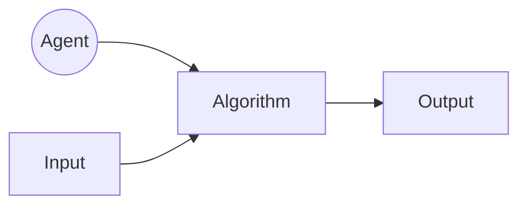

# AlgorithmDesignAndAnalysis

<h1> 1. The Analysis Framework</h1>
<ul>
<h3> <i><ins>A.Time Efficiency:</ins></i> It is also called <i><ins>Time Complexity </ins></i>,It indicates how fast an algorithm runs .</h3>
<h3> <i><ins>B.Space Efficiency:</ins></i> It is also called <i><ins>Space Complexity</ins></i>, refers to amount of memory units required by the algorithm in addition to the space needed for its input and output .</h3>
<ul>
<li><h3> <a href="https://github.com/AvinandanBose/AlgorithmDesignAndAnalysis/blob/main/1.The%20Analysis%20Framework.pdf">1.The Analysis Framework Doc</h3></li>
</ul>
</ul>
<h1> 2. Overview Of Algorithms</h1>
<ul>

<h3> <i><ins>A. Agent:</ins></i> It can be a human or a computer, is the performer. An agent is just something that acts. In terms of computer: Computer operate autonomously, perceive their environment, persist over a prolonged period, adapt to change, and create and pursue goals. A rational agent is one that acts so as to achieve the best outcome or, when there is uncertainty, the best outcome. .</h3>

<h3> <i><ins>B.Algorithm:</ins></i> An algorithm is a sequence of unambiguous for solving a problem, i.e., for obtaining a required output for any legitimate input in a finite amount of time. Algorithm refers to the steps to be carried out in order to accomplish a particular task .</h3>

<h3> Three things to be considered while writing algorithm:<i><ins>Input</ins></i>, <i><ins>process</ins></i>, and <i><ins>output</ins></i>.The input that we give to an algorithm is processed with the of the procedure and finally returns the output. </h3>

<li><h3> <a href="https://github.com/AvinandanBose/AlgorithmDesignAndAnalysis/blob/main/2.Overview%20Of%20Algorithms.pdf">2. Overview Of Algorithms Doc</h3></li>  

</ul>

<h1> 3. Ways of Writing an Algorithm</h1>
<ul>
<h3> There are various ways of writing an algorithm. </h3>
</ul>

