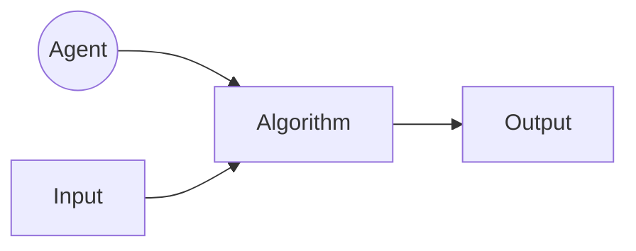
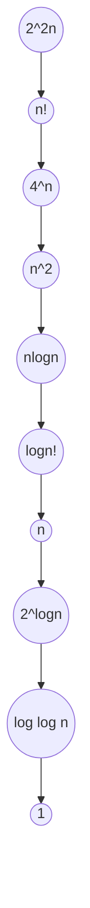

# AlgorithmDesignAndAnalysis

<h1> 1. The Analysis Framework</h1>
<ul>
<h3> <i><ins>A.Time Efficiency:</ins></i> It is also called <i><ins>Time Complexity </ins></i>,It indicates how fast an algorithm runs .</h3>
<h3> <i><ins>B.Space Efficiency:</ins></i> It is also called <i><ins>Space Complexity</ins></i>, refers to amount of memory units required by the algorithm in addition to the space needed for its input and output .</h3>
<ul>
<li><h3> <a href="https://github.com/AvinandanBose/AlgorithmDesignAndAnalysis/blob/main/1.The%20Analysis%20Framework.pdf">1.The Analysis Framework Doc</h3></li>
</ul>
</ul>
<h1> 2. Overview Of Algorithms</h1>
<ul>



```mermaid

flowchart LR
    id1((Agent))
    id1 --> Algorithm
    Input --> Algorithm
    Algorithm --> Output
    
```

<h3> <i><ins>A. Agent:</ins></i> It can be a human or a computer, is the performer. An agent is just something that acts. In terms of computer: Computer operate autonomously, perceive their environment, persist over a prolonged period, adapt to change, and create and pursue goals. A rational agent is one that acts so as to achieve the best outcome or, when there is uncertainty, the best outcome. .</h3>


<h3> <i><ins>B.Algorithm:</ins></i> An algorithm is a sequence of unambiguous for solving a problem, i.e., for obtaining a required output for any legitimate input in a finite amount of time. Algorithm refers to the steps to be carried out in order to accomplish a particular task .</h3>


<h3> Three things to be considered while writing algorithm:<i><ins>Input</ins></i>, <i><ins>process</ins></i>, and <i><ins>output</ins></i>.The input that we give to an algorithm is processed with the of the procedure and finally returns the output. </h3>

<li><h3> <a href="https://github.com/AvinandanBose/AlgorithmDesignAndAnalysis/blob/main/2.Overview%20Of%20Algorithms.pdf">2. Overview Of Algorithms Doc</h3></li> 

<h3><i>Examples : </i></h3>
<ul>
<li><h3>1. Euclid's Algorithm To Find Greatest Common Digit(GCD).</h3></li> 

```Syntax

//English Like Algorithm
Euclid's algorithm for computing GCD(m,n)

Step 1: If n = 0 , return the value of m as the answer and stop; otherwise proceed to Step 2.
Step 2: Divide m by n and assign the value of the remainder to r.
Step 3: Assign the value of n to m and the value to r to n . Go to Step 1.

//Pseudo Code

Euclid (m,n)
//Computes gcd(m,n) by Euclid's algorithm
//Input: Two nonnegative, not both zero integers m and n
//Output: Greatest Common Divisor of m and n

while n ≠ do
  r ← m mod n
  m ← n
  n ← r


```

<ul>

<li><h3> <a href="https://github.com/AvinandanBose/AlgorithmDesignAndAnalysis/blob/main/2.a.Euclid's%20Algorithm%20for%20computing%20gcd(m%2Cn).pdf"> Euclid's Algorithm To Find Greatest Common Digit(GCD) - Algorithm</h3></li>

<li><h3> <a href="https://github.com/AvinandanBose/JavaClassicalDataStructure/blob/main/Euclid.java">Euclid’s Algorithm To Find GCD(m,n) in Java Program[Algorithm Examples]</a></h3></li>

</ul>


<li><h3>2. Consecutive Integer Checking Algorithm  To Find Greatest Common Digit(GCD).</h3></li> 

```Syntax

//English Like Algorithm
Consecutive Integer Checking Algorithm for computing GCD(m,n)

Step 1: Assign the value of min{m,n} to t
Step 2: Divide m by t . If the remainder of this division is 0, 
	go to Step 3; otherwise , go to Step 4. 
	
Step 3: Divide n by t . If  the remainder of this division is 0, 
	return the value of t as the answer and stop; otherwise
	proceed to Step 4.
	
Step 4: Decrease the value of t by 1. Go to Step 2.
	


//Pseudo Code

GCD(m,n):
t←MIN⁡(m,n)
i←0
for i←t to 1 do
  if n mod i=0  And m mod i=0
     STOP
return i

MIN(i , j):
result ←0
if i <j∶
     result ←i
else if j<i:
	result←j
return result

```

<ul>

<li><h3> <a href="https://github.com/AvinandanBose/AlgorithmDesignAndAnalysis/blob/main/2.b.%20Consecutive%20Integer%20Checking%20Algorithm%20%20To%20Find%20Greatest%20Common%20Digit(GCD).pdf"> Consecutive Integer Checking Algorithm  To Find Greatest Common Digit(GCD) - Algorithm</h3></li>

<li><h3> <a href="https://github.com/AvinandanBose/JavaClassicalDataStructure/blob/main/ConsIntCheckAlgo.java">Consecutive Integer Checking Algorithm  To Find Greatest Common Digit(GCD) in JAVA[Algorithm Examples]</a></h3></li>

</ul>


<li><h3>3. Middle School Procedure  To Find Greatest Common Digit(GCD).</h3></li> 

```Syntax

-----------------------------------------------
// English Like Algorithm
----------------------------------------------
Step 1: Find the prime factors of m.
Step 2: Find the prime factors of n.
Step 3: Identify all the common factors in the two prime expansions found in Step 1 and Step 2. 
(If p is a common factor occurring p_m   and p_n  times in m and n ,respectively ,
it should be repeated min⁡{p_m,p_n } times.)

E.g.: 
	60 =  2 ×2 ×3 ×5
	24 = 2×2×2×3
gcd⁡(60,24)=2×2×3=12


-----------------------------------------------
// Pseudo Code
----------------------------------------------

GCD(M,N):
	int IndexA ←0
	int IndexB←0
	int res←1
        Arr1[p]=primeFact(M)
        Arr2[q]=primeFact(N)
       Arr3[n]←NULL
      While(IndexA<p AND IndexB<q):
      
           if(Arr1[IndexA]== Arr2[IndexB]):
                   Arr3[n]←Arr1[IndexA]
                   IndexA←IndexA+1
                   IndexB←IndexB+1
            Else If(Arr1[IndexA]< Arr2[IndexB]) :
                   IndexA←IndexA+1
             Else:
                IndexB←IndexB+1	
  PrimeFact(n):
     Arr1[p]←NULL
        for i ←2 to n-1 do
           while ( n mod i ←0):
            n ← n / i
            Arr1[i]←i
   return Arr1


```


  

<ul>

<li><h3> <a href="https://github.com/AvinandanBose/AlgorithmDesignAndAnalysis/blob/main/2.c.%20Middle%20School%20Procedure%20to%20find%20GCD(m%2Cn).pdf">  Middle School Procedure  To Find Greatest Common Digit(GCD) - Algorithm</h3></li>
<li><h3> <a href="https://github.com/AvinandanBose/JavaClassicalDataStructure/blob/main/MiddleSchoolProc.java">Middle School Procedure To  Find Greatest Common Digit(GCD) in JAVA [Algorithm Examples] </a></h3></li>


</ul>

<li><h3>4.Sieve Of Eratosthenes To Find Prime Numbers.</h3></li>


```Syntax

:Description:

Given a Number N, print all Prime Numbers smaller than or equal to N. 

Process to find out Sieve of Eratosthenes
1.As prime number starts from 2
Therefore mark all multiples of 2 and exclude them.

2.Next prime number will be 3 , 
there fore mark all multiples of 3 and exclude them.

3.And this process will continue till we reach N .


-----------------------------------------------
// English Like Algorithm
----------------------------------------------

Step 1:	First fill an array to True up to N times.
Step 2:	Next Make those multiples of Numbers TO FALSE
Step 3:	Print those Numbers which remains True

----------------
//PSEUDO CODE//
-----------------

Prime(N):
Boolean a[N+1]
for i←2 to N do:
	a[i]←true
for i←2 to N do:
   if (a[i]=True)Then:
      Print(i)
        for j←i*i to n do:
           a[j]←False


```

<ul>

<li><h3> <a href="https://github.com/AvinandanBose/AlgorithmDesignAndAnalysis/blob/main/2.d.%20SieveOFEratosthenes.pdf">  Sieve of Eratosthenes To Find Prime Numbers - Algorithm</h3></li>

<h3><i> Java Programs Solving Sieve of Eratosthenes To Find Prime Numbers </i></h3>
<ul>

<h3> <a href="https://github.com/AvinandanBose/JavaClassicalDataStructure/blob/main/SeiveOfErastosthenes.java">1. Sieve of Eratosthenes To Find Prime Numbers in JAVA(1)[Algorithm Examples]</a></h3>
<h3> <a href="https://github.com/AvinandanBose/JavaClassicalDataStructure/blob/main/SieveOfErastothenes1.java">2. Sieve of Eratosthenes To Find Prime Numbers in JAVA(2)[Algorithm Examples] </a></h3>
<h3> <a href="https://github.com/AvinandanBose/JavaClassicalDataStructure/blob/main/sieveOfEratosthenes.java">3. Sieve of Eratosthenes To Find Prime Numbers in JAVA(3)[Algorithm Examples] </a></h3>

</ul>


</ul>

</ul>


</ul>

<h1> 3. Ways of Writing an Algorithm</h1>
<ul>
<h3> There are various ways of writing an algorithm. </h3>
    <ul>
        <li><h3> 1.<ins>English-Like Algorithm</ins></h3></li> 
        <ul>
            <h3><i><ins>Eg:</ins></i></h3>
            
```Syntax

Algorithm : English – like algorithm of linear search.
	
Step 1: Compare `item` with the first element of the array, A.
Step 2: If the two are same, then print the position of the element and exit.
Step 3: Else repeat the above process with the rest of the elements.
Step 4: If the item is not found at any position, then print ‘not found’ and exit.

```

<h3> Disadvantage:</h3>
<ul>
<li><h3> 1.Natural Languages can be ambiguous and therefore its lack the characteristics of being definite.</h3></li> 
<li><h3> 2.English language-like algorithms are not considered good for most of the task.</h3></li> 
</ul>
            
</ul>

<li><h3> 2.<ins>Flow Chart</ins></h3></li> 
<ul>
<h3> Flowcharts pictorially depict a process. They are easy to understand and are commonly used in the case of simple problems.</h3> 
</ul>
<li><h3> 3.<ins>Pseudo-code.</ins></h3></li> 
<ul>
<h3>An artificial and informal language constituting of notations helps in resembling a simplified programming language, used in program design. This way of writing algorithm is most acceptable and most widely used.</h3> 
</ul>
</ul>
<ul>
<li><h3> <a href="https://github.com/AvinandanBose/AlgorithmDesignAndAnalysis/blob/main/3.Ways%20of%20Writing%20An%20Algorithm.pdf">3. Ways Of Writing Algorithms Doc[with Full Description]</h3></li> 

</ul>
</ul>
<h1> 3. Some Mathematical Concepts</h1>
<ul>
<h3> Prior going with the analysing part of the Programming concept , one must have clear understanding  on :</h3>
<ul>
.....
</ul>


</ul>

<h1> 4. Rate of Growth</h1>
<ul>

<h3>The <i>Rate Of Growth</i> helps to find the behavior of an Algorithm. The rate at which the running time increases as a function of input is called <i>Rate Of Growth</i>.The <i>Rate Of Growth Of An Algorithm</i> is the rate at which its running time increases as a function of input <i>‘n’</i>. </h3>
<ul>
 <h3><li><a href="https://github.com/AvinandanBose/AlgorithmDesignAndAnalysis/blob/main/Rate%20of%20Growth.pdf"> Rate of Growth -In Details</li></h3>
</ul>


</ul>

<h1> 5.Algorithm Classes / Commonly Used Rates of Growth</h1>
<ul>

<Table>
<tr>
<th>Function Name</th>
<th>Name used for algorithm analysis</th>
<th>Remarks</th>	
</tr>
	
<tr>
<td> c</td>
<td>Constant Algorithm</td>
<td>These algorithms are independent of the input.</td>	
</tr>
	
<tr>
<td> Log log N</td>
<td>Log log⁡ function</td>
<td>Logarithmic algorithms are preferred, as their growth is always low.</td>	
</tr>
	
	
<tr>
<td> Log N</td>
<td>logarithmic</td>
<td>These are very optimal algorithms.</td>	
</tr>
	
<tr>
<td> Log^2 N</td>
<td>Log-squared</td>
<td>These are optimal algorithms.</td>	
</tr>
	
<tr>
<td> N</td>
<td>Linear algorithm</td>
<td>Linear algorithms are preferred, e.g., summing of an array.</td>	
</tr>
	
<tr>
<td> N^2</td>
<td>Quadratic</td>
<td>Sorting algorithms are preferred, e.g., bubble sort, selection sort.</td>	
</tr>
	
<tr>
<td> N^3</td>
<td>Cubic</td>
<td>Matrix multiplication is preferred.</td>	
</tr>
	
<tr>
<td> N^k</td>
<td>Polynomial</td>
<td>Polynomial algorithms of lesser order k are preferred.</td>	
</tr>
	
<tr>
<td> a^n</td>
<td>Exponential</td>
<td>Here a is constant, and intractable algorithms are exponential.</td>	
</tr>
	
<tr>
<td> N!</td>
<td>Factorial</td>
<td>These algorithms are intractable.</td>	
</tr>
	
	
	
</Table>
	
 <h3><li><a href="https://github.com/AvinandanBose/AlgorithmDesignAndAnalysis/blob/main/5.Comparison%20Framework.pdf"> Algorithm Classes / Commonly Used Rates of Growth</li></h3>
</ul>

<h1> 6.RELATIONSHIP BETWEEN DIFFERENT RATES OF GROWTH</h1>

<ul>



```mermaid

flowchart TD

    id1((2^2n))
    id2((n!))
    id3((4^n))
    id4((n^2))
    id5((nlogn))
    id6((logn!))
    id7((n))
    id8((2^logn))
    id9((log log n))
    id10((1))
    
  
    id1 --> id2
    id2 --> id3
    id3 --> id4
    id4 --> id5
    id5 --> id6
    id6 --> id7
    id7 --> id8
    id8 --> id9
    id9 --> id10
      
    
```

<h3 align="Center"> <i> The above Diagram shows decreasing rates of growth. </i></h3>

<h3> <li><a href="https://github.com/AvinandanBose/AlgorithmDesignAndAnalysis/blob/main/6.Relationship%20between%20different%20rates%20of%20growth.pdf"> Relationship between different rates of growth - In Details </a> </li></h3>

</ul>

<h1>7.Need for Analysing Algorithm </h1>
<ul>

<h3><i>It is reasonable to measure an algorithm’s efficiency as a function of a parameter indicating the size of the algorithm’s input. But there are many algorithms for which running time depends not only on an input size but also on the specifics of a particular input.</i></h3>

<ul>
<ul>
<h3><li> It is logical to assume that the efficiency of algorithms depends solely on the input size n.</li></h3> 

<h3><li> Efficiency of an algorithm also depends upon the distribution of input data as well.</li></h3> 
</ul>
</ul>

<h3><i> Hence we represents the algorithm with multiple expressions:</i></h3>

<ul>
<ul>
<h3><li> One for the case where it takes less time: <ins><i>Best Case.</i></ins></li></h3> 

<h3><li> Another for the case where it takes more time: <ins><i>Worst Case.</i></ins></li></h3> 
<h3><li> And there is another case where input is random and number of trials taken gives an average runtime , hence we get the third case : <ins><i>Average Case.</i></ins></li></h3> 
</ul>

</ul>
<h3><i>And to analyse an algorithm, we need some kind of syntax and that forms the base for <ins>Asymptotic Analysis/Notation.</ins></i></h3>

<ul>
<ul>

<h3><li> <a href="https://github.com/AvinandanBose/AlgorithmDesignAndAnalysis/blob/main/7.Need%20for%20Analysing%20Algorithm.pdf"> Need For Analysing Algorithm - In Details </li></h3>

<ul>
<h3> <a href="https://github.com/AvinandanBose/JavaClassicalDataStructure/blob/main/java_sequential_Search.java">1. Sequential Search using while loop </a><h3>

```Syntax

ALGORITHM: SEQUENTIAL SEARCH ( 𝑨[𝟎. . 𝒏 − 𝟏], 𝑲 ) 
//Searches for a given value in each array by sequential Search 
//Input: An array A[0..n-1] and a search key K 
//Output: The index of the first element in A that matches K 
// or -1 if there are no matching elements. 
𝟏 ← 𝟎 
while 𝒊 < 𝒏 and A[i] ≠ 𝑲 𝒅𝒐 
       𝒊 ← 𝒊 + 𝟏 
if  𝒊 < 𝒏 𝒓𝒆𝒕𝒖𝒓𝒏 𝒊 
𝒆𝒍𝒔𝒆 𝒓𝒆𝒕𝒖𝒓𝒏 − 𝟏 

```

<h3> <a href="https://github.com/AvinandanBose/JavaClassicalDataStructure/blob/main/java_sequential_Search1.java">2. Sequential Search using for loop</a></h3>
<h3> <a href="https://github.com/AvinandanBose/JavaClassicalDataStructure/blob/main/java_sequential_Search2.java">3. Sequential Search using Recursion</a></h3>

</ul>
</ul>

</ul>
</ul>

<h1>8.Types of Analysis </h1>
<ul>

<ul>
<h3><ins>1. Worst Case Complexity And UpperBound :</ins>The worst-case efficiency of an algorithm is its efficiency for the worst-case input of size n , which is an input (or inputs) of size n, for which the algorithm runs the longest among all possible inputs of that size.</h3>
<ul>
<h3><ins>1.a.Upper Bound :</ins>The upper bound of an algorithm  is the measure of the maximum computational effort required to solve a given problem.</h3>
</ul>


</ul>

<ul>
<h3><ins>2. Best Case Complexity and Lower Bound :</ins>The best-case efficiency of an algorithm is its efficiency for the best-case of size n, which is an input( or inputs) of size n for which  the algorithm runs fastest among all possible inputs of that size.</h3>
<ul>
<h3><ins>2.a.Lower Bound :</ins>The Lower Bound of an algorithm  is the measure of the minimum computational effort required to solve a given problem.</h3>
</ul>

</ul>

<ul>
<h3><ins>3. Average-case Complexity :</ins>The average-case analysis assumes that the input is random and provides prediction about the running time of an algorithm for a random input.</h3>

</ul>

<h3><li> <a href="https://github.com/AvinandanBose/AlgorithmDesignAndAnalysis/blob/main/8.Types%20Of%20Analysis.pdf">Types of Analysis(Worst Case , Best Case and Average Case Complexity) - In Details </li></h3>

</ul>

<h1>9.Asymptotic Notation </h1>
<ul>
<h2 > 1. INTRODUCTION </h2>
<ul>

<h3>The word ‘Asymptote’ means a line that approaches the curve of 
the polynomial approximately.</h3>
<h3> </h3>
<h3>Asymptotic Notation finds the upper bound of the polynomial as 
in the case of ‘Big Oh (O)’ notation or the lower bound as in the 
case of ‘𝝎’ small omega notation or containment as in the case of 
‘ 𝜽’ (Theta ) notation. </h3>
 <h3> </h3>
 <h3>A program in computer can be assumed as a Function (F(n)) 
which have rate of growth to a constant time or infinite runtime . </h3>
  <h3> </h3>
 <h3>Asymptotic notation helps to find the functions complexity 
through analyzing. It helps in optimization. </h3>

<h3><li> <a href="https://github.com/AvinandanBose/AlgorithmDesignAndAnalysis/blob/main/9.Asymtotic%20Notation-Intro.pdf">Asymptotic Notation - Introduction (Details) </li></h3>


</ul>

<h2 > 2. Big -O Notation </h2>
<ul>
<h3><i>Definition:</i>  A function f(n) is said to be in O(g(n)) , denoted f(n)∈ O(g(n)  ) , if f(n)  is bounded above by some constant 
multiple of g(n)  for all large n,i.e.if there exist some positive 
constant c and  some nonnegative integer n0  such that: f(n)≤cg(n)  for all n≥n0 . </h3>
<ul>
<h2 align=center > Big -O Notation - Analysis</h2>
<h3><li> <a href="https://github.com/AvinandanBose/AlgorithmDesignAndAnalysis/blob/main/9.a.Big_O_Notation(Theory).pdf">1. Big -O Notation - Theory(Details with Mathematical Analysis) </li></h3> 
<h2 align=center > Big -O Notation - Mathematical Examples </h2>	
<h3><li> <a href="https://github.com/AvinandanBose/AlgorithmDesignAndAnalysis/blob/main/9.a.1.BigONotation_MathematicalExamplesAndProofs.pdf">2. Big -O Notation - Theory(Mathematical Examples with Proofs ) </li></h3>

<h2 align=center >Big O Notation with Limits- Big O Ratio Theorem </h2>
<h3><li> <a href="https://github.com/AvinandanBose/AlgorithmDesignAndAnalysis/blob/main/9.a.2.Big%20O%20Notation%20with%20Limits-%20Big%20O%20Ratio%20Theorem.pdf">3.Big O Notation with Limits- Big O Ratio Theorem -In Details </li></h3>

<table>


<tr>
<td>S.No.</td>
<td>What it means ? </td>
<td>In terms of Limits</td>
<td> How it is represented ?</td>
<td>Mathematically Equivalence </td>
</tr>

<tr>
<td>O(big oh)</td>
<td>Growth of f(n) is ≤ the growth of g(n) </td>
<td>(lim)n→∞⁡〖f(n)/g(n)≠∞〗</td>
<td> f(n)=O(g(n))</td>
<td>≤</td>
</tr>
</table>

<h2 align=center >Properties of Big-Oh Notation </h2>

<ul>
<h3><li> 1. For big-Oh, only the dominating summand matters. For example , O(n^4+n^2+64) =O(n^4 ). It can be observed that all terms other than the highest degree are ignored.</li></h3>

<h3><li> 2.In addition, in the big-Oh notation, constant factors are not significant. For example, O(3n^5 )=O(n^5). In general, O(k.g(n))=O(g(n)), where k≠0.</li></h3>

<h3><li> 3. Big -Oh can be used to express tight bounds. A bound is called a tight bound or least upper bound if the difference between the actual and bound function is a constant . For example , n^2 cannot be expressed as O(n^3 ).  It should only be expressed as O(n^2) as it is the best fit. In this case it is called a tight fit or the least upper bound.</li></h3>


<ul>
<ul>
<h3> <a href="https://github.com/AvinandanBose/AlgorithmDesignAndAnalysis/blob/main/9.a.3.Properties%20of%20BigOh%20notation.pdf">Properties of Big-Oh Notation -In Details </h3>
</ul>
</ul>


</ul>
</ul>
</ul>

<h2 > 3. Big -Omega(Ω) Notation </h2>

<ul>
<h3><i>Definition:</i> A function f(n) is said to be in Ω(g(n)), denoted f(n) ε Ω(g(n)),if f(n)  is bounded below by some positive constant multiple of g(n)  for all large n ,i.e.,if there exist some positive constant c and some nonnegative integer n0  such that: f(n)≥c ×g(n)  for all n≥n0.</h3>

<ul>
<h2 align=center > Big -OMEGA(Ω) Notation - Analysis</h2>
<h3><li> <a href="https://github.com/AvinandanBose/AlgorithmDesignAndAnalysis/blob/main/9.b.Big-omega%20notation(Theory).pdf">1. Big -Omega(Ω) Notation - Theory(Details with Mathematical Analysis) </li></h3> 

<h2 align=center > Big -OMEGA(Ω) Notation - Mathematical Examples</h2>

<h3><li> <a href="https://github.com/AvinandanBose/AlgorithmDesignAndAnalysis/blob/main/9.b.1.Big_Omega_Notation_Theorem_And_Proofs.pdf">2. Big -Omega(Ω) Notation - Theory(Mathematical Examples with Proofs) </li></h3> 

<h2 align=center >Big -OMEGA(Ω) Notation with Limits- Big OMEGA(Ω) Ratio Theorem </h2>
<h3><li> <a href="https://github.com/AvinandanBose/AlgorithmDesignAndAnalysis/blob/main/9.b.2.Big%20Omega%20Notation%20with%20Limits-%20Big%20Omega%20Ratio%20Theorem.pdf">3.Big -OMEGA(Ω) Notation with Limits- Big OMEGA(Ω) Ratio Theorem -In Details </li></h3>

<table>


<tr>
<td>S.No.</td>
<td>What it means ? </td>
<td>In terms of Limits</td>
<td> How it is represented ?</td>
<td>Mathematically Equivalence </td>
</tr>

<tr>
<td>Ω(big Omega)</td>
<td>Growth of f(n) is ≥ the growth of g(n) </td>
<td>(lim)n→∞⁡〖f(n)/g(n)≠0〗</td>
<td> f(n)=Ω(g(n))</td>
<td>≥</td>
</tr>
</table>

</ul>

</ul>
<h2 > 4. Big Theta (Θ) Notation </h2>

<ul>
<h3><i>Definition:</i> A function f(n)is said to be in Θ(g(n)),denoted f(n)∈Θ(g(n)),if f(n)  is bounded both above and below by some positive constant multiples of g(n)for all large n,i.e.if there exist some positive constants c1  and c2 and some non-negative integer n0  such that: c1×g(n) ≤ f(n) ≤ c2×g(n)   for all n≥n0.</h3>

<ul>

<h2 align=center > Big Theta (Θ) Notation - Analysis</h2>
<h3><li> <a href="https://github.com/AvinandanBose/AlgorithmDesignAndAnalysis/blob/main/9.c.Big-Theta%20notation(Theory).pdf">1. Big Theta (Θ) Notation - Theory(Details with Mathematical Analysis) </li></h3> 

<h2 align=center > Big Theta (Θ) Notation - Mathematical Examples</h2>

<h3><li> <a href="https://github.com/AvinandanBose/DataStructureAndAlgorithm_Theory/blob/main/9.c.1.Big-Theta%20notation%20-%20MathematicalExamples%20And%20Proofs.pdf">2. Big Theta (Θ) Notation - Theory(Mathematical Examples with Proofs) </li></h3> 

<h2 align=center >Big Theta (Θ) Notation with Limits- Big Theta(Θ) Ratio Theorem </h2>

<h3><li> <a href="https://github.com/AvinandanBose/DataStructureAndAlgorithm_Theory/blob/main/9.c.2.Big%20Theta%20Notation%20With%20Limits-%20Big%20Theta%20Ratio%20Theorem.pdf">3. Big Theta (Θ) Notation with Limits- Big Theta(Θ) Ratio Theorem -In Details</li></h3> 

<table>


<tr>
<td>S.No.</td>
<td>What it means ? </td>
<td>In terms of Limits</td>
<td> How it is represented ?</td>
<td>Mathematically Equivalence </td>
</tr>

<tr>
<td>Θ(Big Theta)</td>
<td>Growth of f(n) is ≈ the growth of g(n) </td>
<td>(lim)n→∞⁡〖f(n)/g(n)=c,c > 0〗</td>
<td> f(n)=Θ(g(n))</td>
<td>≈(roughly equal to)</td>
</tr>
</table>

<h2 align=center >Properties of Big Theta (Θ) Notation </h2>

<ul>
<h3><li> 1. If f(n)= Ο(g(n))  and g(n)=Ο(f(n)),then f(n)=Θ(n).</li></h3>

<h3><li> 2.If we deduce the equation of Big Theta Θ(n):c1g(n)≤f(n)≤c2g(n) for all n≥n0 , we get 1) c1 g(n)≤f(n)  or f(n)≥c1 g(n),for all n≥n0  is Ω(n) and 2)f(n)≤c2 g(n),for all n≥n0  is Ο(n).Hence both upper bound and lower bound must exists to have Theta notation (Average Complexity)that is tight upper bound and tight lower bound must exist to produce tight bound. </li></h3>

<h3><li> 3. For any polynomial of the order of k , one can show that :f(n)  is in Θ(n^k ), for Eg: log(n!)= Θ(nlogn) as discussed below.</li></h3>


<ul>
<ul>
<h3> <a href="https://github.com/AvinandanBose/DataStructureAndAlgorithm_Theory/blob/main/9.c.3.Properties%20of%20BigTheta%20notation.pdf">Properties of Big Theta (Θ) Notation -In Details with An Example</h3>
</ul>
</ul>


</ul>

<h2><i>Rarely Used Asymptotic Notations</i></h2>
<ul>
<h2><li> 1.Little oh (ο) Notation</li></h2> 
<h3>Definition:Let f and g be two functions that map a set of natural numbers to a set of positive real numbers, f:N⟶R.
Let ο(g)be the set of all functions with a similar rate of growth.
The relation f(n)=ο(g(n)) holds good, if there exist two positive constants c and n0 such that f(n) < c × g(n) for all n>n0. It gives us <i>Loose Upper Bound</i>.</h3>
<h3> <a href="https://github.com/AvinandanBose/DataStructureAndAlgorithm_Theory/blob/main/10.Little%20oh%20Notation(With%20Example).pdf
">Little oh Notation(o) Notation -In Details With  Example[Examples with Limits and without Limits to have the idea of difference between Big O and Little o notation.]</h3>

<table>


<tr>
<td>S.No.</td>
<td>What it means ? </td>
<td>In terms of Limits</td>
<td> How it is represented ?</td>
<td>Mathematically Equivalence </td>
</tr>

<tr>
<td>𝝄(little oh)</td>
<td>Growth of f(n) is < the growth of g(n) </td>
<td>(lim)n→∞⁡〖f(n)/g(n)=0〗</td>
<td>  𝒇(𝒏)=ο(𝒈(𝒏))</td>
<td><</td>
</tr>
</table>
<h2><li> 2.Little omega (ω) Notation</li></h2> 	
<h3>Definition:Let f and g be two functions that map a set
of natural numbers,that is f:N→R.Let ω(g)be the set of 
all functions with a similar rate of growth .The relation
f(n)= ω(g(n))  holds,if there exists two positive 
constants c and n0  such that∶ f(n)>c×g(n) for all n>n0.
 It gives us <i>Loose Lower Bound</i>.</h3>
<h3> <a href="https://github.com/AvinandanBose/DataStructureAndAlgorithm_Theory/blob/main/11.Little%20omega%20Notation(With%20Example).pdf
">Little omega Notation(ω) Notation -In Details With  Example[Examples with Limits and without Limits to have the idea of difference between Big Omega(Ω) and Little omega (ω) notation.]</h3>

<table>


<tr>
<td>S.No.</td>
<td>What it means ? </td>
<td>In terms of Limits</td>
<td> How it is represented ?</td>
<td>Mathematically Equivalence </td>
</tr>

<tr>
<td>ω(little omega)</td>
<td>Growth of f(n) is > the growth of g(n) </td>
<td>(lim)n→∞⁡〖f(n)/g(n)=∞〗</td>
<td>  𝒇(𝒏)=ω(𝒈(𝒏))</td>
<td>></td>
</tr>
</table>

<h2><li> 3.Tilde Notation (~)</li></h2> 
<h3>Definition:Definition: The notation is useful when the function f(n) and g(n) growth at the same rate. It is written as:f(n)~g(n).Here it suggest f(n)/g(n)  approaches to 1 as N grows, which means :</h3>


<h3> <a href="https://github.com/AvinandanBose/DataStructureAndAlgorithm_Theory/blob/main/12.Tilde%20Notation(With%20Example).pdf
">Tilde(~) Notation -In Details With  Examples.</h3>

<table>


<tr>
<td>S.No.</td>
<td>What it means ? </td>
<td>In terms of Limits</td>
<td> How it is represented ?</td>
<td>Mathematically Equivalence </td>
</tr>

<tr>
<td>Tilde(~)</td>
<td>Growth of f(n) is = the growth of g(n) </td>
<td>(lim)n→∞⁡〖f(n)/g(n)=1〗</td>
<td>  f(n)~g(n)</td>
<td>=</td>
</tr>
</table>
</ul>
<h2><i> Using L'Hospital Theorem to find Rate of Growth</i></h2> 
<ul>
	


 
 <h3> <a href="https://github.com/AvinandanBose/DataStructureAndAlgorithm_Theory/blob/main/13.LHospital%20Rule%20To%20Find%20Rate%20Of%20Growth.pdf">L'Hospital Theorem to find Rate of Growth - With an Example.</h3>
 
 
</ul>
</ul>
<h2></h2>
<h2>9.a.Asymptotic Rules </h2>
<ul>

<li><h3><ins> 𝟏. 𝑹𝒆𝒇𝒍𝒆𝒙𝒊𝒗𝒊𝒕𝒚 𝑹𝒖𝒍𝒆</ins>: 𝑭𝒐𝒓 𝒂𝒏𝒚 𝒈𝒆𝒏𝒆𝒓𝒂𝒍 𝒄𝒐𝒎𝒑𝒍𝒆𝒙𝒊𝒕𝒚 𝒇𝒖𝒏𝒄𝒕𝒊𝒐𝒏 , 𝒕𝒉𝒆 𝒓𝒆𝒇𝒍𝒆𝒙𝒊𝒗𝒆 𝒑𝒓𝒐𝒑𝒆𝒓𝒕𝒚 𝒊𝒔 𝒈𝒊𝒗𝒆𝒏 𝒂𝒔 𝒇𝒐𝒍𝒍𝒐𝒘𝒔:</h3></li>

 

 <li><h3><ins> 𝟐.𝑻𝒓𝒂𝒏𝒔𝒊𝒕𝒊𝒗𝒊𝒕𝒚 𝒓𝒖𝒍𝒆</ins>: 𝑻𝒉𝒆 𝒕𝒓𝒂𝒏𝒔𝒊𝒕𝒊𝒗𝒆 𝒑𝒓𝒐𝒑𝒆𝒓𝒕𝒚 𝒊𝒔 𝒅𝒆𝒇𝒊𝒏𝒆𝒅 𝒂𝒔 𝒇𝒐𝒍𝒍𝒐𝒘𝒔:</h3></li>


 
 <li><h3><ins>𝟑. 𝑳𝒂𝒘 𝒐𝒇 𝑪𝒐𝒎𝒑𝒐𝒔𝒊𝒕𝒊𝒐𝒏</ins>:</h3></li>


 <li><h3><ins> 𝟒. 𝑺𝒖𝒎𝒎𝒂𝒕𝒊𝒐𝒏 𝑹𝒖𝒍𝒆</ins>:</h3></li>
 
 

 
  <li><h3><ins> 𝟓. 𝑴𝒖𝒍𝒕𝒊𝒑𝒍𝒊𝒄𝒂𝒕𝒊𝒐𝒏 𝑹𝒖𝒍𝒆</ins>:</h3></li>
  
   

<li><h3><ins> 𝟔. 𝑻𝒓𝒂𝒏𝒔𝒑𝒐𝒔𝒆 𝑺𝒚𝒎𝒎𝒆𝒕𝒓𝒚</ins>:</h3></li>


 
 <li><h3><ins> 𝟖. 𝑪𝒐𝒏𝒔𝒕𝒂𝒏𝒕 𝑹𝒖𝒍𝒆</ins>:</h3></li>
 


 
 <ul>
  <li><h3> <a href="https://github.com/AvinandanBose/DataStructureAndAlgorithm_Theory/blob/main/14.Asymptotic%20Rules.pdf">Asymptotic Rules Explained In Details</h3>  </li>
	  
</ul>


</ul>
<h2></h2>
<h2>9.b.Mathematical Induction In Asymptotic Notation </h2>
<ul>


<h3> <i>The Mathematical Induction can be applied in Asymptotic notation to prove f(n).</i></h3>
<ul>

 <li><h3> <a href="https://github.com/AvinandanBose/DataStructureAndAlgorithm_Theory/blob/main/15.How%20to%20use%20Mathematical%20Induction%20in%20Asymptotic%20Notation.pdf">Application of Mathematical Induction in Asymptotic notation -In Details</h3>  </li>


</ul>

</ul>
<h2></h2>
<h2>9.c.Theorem Based On Asymptotic Notation. </h2>
<ul>
	


<ul>

<li><h3> <a href="https://github.com/AvinandanBose/DataStructureAndAlgorithm_Theory/blob/main/16.Theorem%20Based%20On%20Asymptotic%20Notation%20With%20Proof..pdf">Theorem Based On Asymptotic Notation -In Details With Proof.</h3>  </li>


</ul>

</ul>

<h2></h2>
<h2>9.d.Asymptotic Complexity Classes. </h2>


<ul>


<h3>And accordingly we can say that in terms of set:</h3>


<ul>

 <li><h3> <a href="https://github.com/AvinandanBose/DataStructureAndAlgorithm_Theory/blob/main/17.Asymptotic%20Complexity%20Classes.pdf">Asymptotic Complexity Classes- In Details </h3></li>


</ul>

<h3><i><ins>Note:</ins></i>Asymptotic notation helps us to find out the time complexity which is rate of growth with time and it depends upon input 'n'. Further Asymptotic notation can be studied using integrals and trigonometry which helps to find out the behaviour of the growth .</h3>

</ul>


</ul>

<h1></h1>
<h1>10.Space Complexity  </h1>
<ul>

<h3>Space complexity refers to the analysis of space that is required for an algorithm. The space here refers to the following two components: 1) Fixed Components
and 2) Variable Part. Therefore, the space complexity:</h3>

<h3>

```math

 \begin{equation}
   \begin{split}
   
S(n) \quad  = \quad fixed \quad components \quad + \quad variable \quad components \quad \quad \quad \quad \quad \quad \quad \quad \quad \quad \quad \quad\quad \quad \quad \quad \quad \quad \quad \quad \quad \quad \quad \quad \\
   
     \end{split}
 \end{equation}

```

</h3>

<h3> Where fixed components are fixed(constants, simple variables, etc.) where as variable part is dependent on the program input/output. Also, </h3>

<h3>

```math

 \begin{equation}
   \begin{split}
   
S(n) \quad  = \quad Auxiliary Space \quad + \quad Input Space \quad  \quad  \quad \quad \quad \quad \quad \quad \quad \quad \quad \quad \quad \quad\quad \quad \quad \quad \quad \quad \quad \quad \quad \quad \quad \quad \\
   
     \end{split}
 \end{equation}

```

</h3>

<h3> Where Auxiliary Space is the extra space that is taken by an algorithm temporarily to finish its work and Input Space is the space used by input. Actual size is also calculated on the basis of size of data types as given in the table below:</h3>


<ul>

 <li><h3> <a href="https://github.com/AvinandanBose/DataStructureAndAlgorithm_Theory/blob/main/18.Space%20Complexity%20Analysis.pdf">Space Complexity Analysis- In Details[With Examples]. </h3></li>
 
</ul>

<h3><i><ins>Note: </ins></i>More on space complexity of alogorithms will be discussed as we go more into this. </h3>

</ul>

<h1></h1>
<h1>11.Guidelines for Asymptotic Analysis  </h1>

<ul>

<h3> Till now we have learnt that: </h3>

<h3>

```math

 \begin{equation}
   \begin{split}
   
Big-Oh(O) \quad gives \quad us \quad Worst \quad Case \quad Time \quad Complexity. \quad \quad \quad \quad \quad \quad \quad \quad \quad \quad \quad \quad \quad \quad \quad \quad \quad \quad \quad \quad \\

\\ 

Big-Oh(Ω) \quad gives \quad us \quad Best \quad Case \quad Time \quad Complexity. \quad \quad \quad \quad \quad \quad \quad \quad \quad \quad \quad \quad \quad \quad \quad \quad \quad \quad \quad \quad \\

\\ 

Big-Theta(Θ) \quad gives \quad us \quad Average \quad Case \quad Time \quad Complexity. \quad \quad \quad \quad \quad \quad \quad \quad \quad \quad \quad \quad \quad \quad \quad \quad \quad \quad \quad \quad \\
   
     \end{split}
 \end{equation}

```

</h3>

<h3> And our priority is to find the Worst Case Complexity other than other complexities. </h3>
<h2></h2>
<h2> 11.a.Asymptotic Analysis of Constant in a Program</h2>
<ul>
<h3>We know that constant in a program always take a unit of time to execute i.e. 1 unit of time. Hence upper bound of constant in a program is always 1 and generate O(1) complexity.</h3>

<h3>

```math


\begin{equation}
   \begin{split}
   
 We \quad know: f(n)≤  c × g(n) \quad where \quad g(n) \quad is \quad tight \quad upper \quad bound \quad of \quad f(n). \quad \quad \quad \quad \quad \quad \quad \quad \quad \quad \quad \quad \quad \quad  \quad \quad \\
 \\ 
  
And  \quad n \quad is \quad the \quad input \quad size. \quad Now  \quad if \quad n \quad is  \quad constant \quad say: \quad \quad \quad \quad \quad \quad \quad \quad \quad \quad \quad \quad \quad \quad \quad \quad \\
  
\\
  
if \quad n=100  \quad then \quad f(100)= 100 × g(1) \quad ,where \quad c=100. \quad Hence \quad O(g(n)) = O(1). \quad \quad \quad   \quad  \quad  \quad \quad \quad \quad \quad \quad \quad \quad \quad \quad \quad \\
 
 \\
 
if \quad n=165  \quad then \quad f(165)= 165 × g(1) \quad ,where \quad c=165. \quad Hence \quad O(g(n)) = O(1). \quad \quad \quad   \quad  \quad  \quad \quad \quad \quad \quad \quad \quad \quad \quad \quad \quad \\
   
   \end{split}
 \end{equation}
```
</h3>

<ul>

<h3> <a href= "https://github.com/AvinandanBose/DataStructureAndAlgorithm_Theory/blob/main/19.Asymptotic%20Analysis%20Approach%20and%20Analysis%20of%20Constant%20Variables.pdf">Asymptotic Analysis Approach and Analysis of Constant Variables- In Details. </a> </h3>


</ul>

</ul>

<h2></h2>
<h2> 11.b.Asymptotic Analysis of For Loop in a Program.</h2>

<ul>
<h3> By seeing the for loop we can determine the <i><ins>lower bound</ins></i> and <i><ins>lower bound</ins></i> and number of inputs taken by the loop depends upon the number of iteration that for loop make from lower bound to upper bound . </h3>


<h3> And we can write in terms of function: </h3>

<h3>

```math


\begin{equation}
   \begin{split}
   
c_1×1≤f(n)={1,2,3,...,n}≤c_2×g(n) \quad where \quad g_1(n)=1 \quad g_2(n)=n \quad \quad \quad   \quad  \quad  \quad \quad \quad \quad \quad \quad \quad \quad \quad \quad \quad \\
\\
But \quad our \quad main \quad focus \quad is \quad f(n)≤c×g(n) \quad ,the \quad upper \quad bound. \quad \quad \quad   \quad  \quad  \quad \quad \quad \quad \quad \quad \quad \quad \quad \quad \quad \\
   
   \end{split}
 \end{equation}
```
</h3>

<h3> Rule: 𝑯𝒐𝒘 𝒎𝒖𝒄𝒉 𝒕𝒊𝒎𝒆 𝒕𝒉𝒆 𝒊𝒏𝒏𝒆𝒓 𝒎𝒐𝒔𝒕 𝒍𝒐𝒐𝒑′𝒔 𝒔𝒕𝒂𝒕𝒆𝒎𝒆𝒏𝒕 𝒓𝒖𝒏 = 𝑻𝒊𝒎𝒆 𝒄𝒐𝒎𝒑𝒍𝒆𝒙𝒊𝒕𝒚 𝒐𝒇 𝒕𝒉𝒆 𝒍𝒐𝒐𝒑. Most favourable approach is to 𝑨𝒅𝒅 𝒖𝒑 𝒂𝒍𝒍 𝒕𝒉𝒆 𝒖𝒏𝒊𝒕𝒔 𝒐𝒇 𝒕𝒊𝒎𝒆 𝒕𝒂𝒌𝒆𝒏 𝒃𝒚 𝒊𝒏𝒏𝒆𝒓𝒎𝒐𝒔𝒕 𝒍𝒐𝒐𝒑 𝒔𝒕𝒂𝒕𝒆𝒎𝒆𝒏𝒕. 𝑩𝒖𝒕 𝒂𝒑𝒑𝒓𝒐𝒂𝒄𝒉 𝒕𝒐 𝒇𝒊𝒏𝒅 𝒄𝒐𝒎𝒑𝒍𝒆𝒙𝒊𝒕𝒚 𝒄𝒉𝒂𝒏𝒈𝒆𝒔 𝒂𝒔 𝒊𝒕 𝒅𝒆𝒑𝒆𝒏𝒅𝒔 𝒖𝒑𝒐𝒏 𝒕𝒉𝒆 𝒊𝒕𝒆𝒓𝒂𝒕𝒊𝒐𝒏 𝒐𝒇 𝒍𝒐𝒐𝒑𝒔 𝒎𝒂𝒌𝒆𝒔 (𝒊. 𝒆. 𝒖𝒑𝒑𝒆𝒓 𝒃𝒐𝒖𝒏𝒅 ,𝒍𝒐𝒘𝒆𝒓 𝒃𝒐𝒖𝒏𝒅 𝒂𝒏𝒅
𝒊𝒏𝒄𝒓𝒆𝒎𝒆𝒏𝒕 𝒂𝒏𝒅 𝒏𝒐. 𝒐𝒇 𝒍𝒐𝒐𝒑𝒔 𝒖𝒔𝒆𝒅. )  </h3>

<ul>

<li><h3> <ins>𝑮𝒆𝒏𝒆𝒓𝒂𝒍 𝑨𝒑𝒑𝒓𝒐𝒂𝒄𝒉 𝑻𝒐 𝑭𝒊𝒏𝒅 𝑻𝒊𝒎𝒆 𝑪𝒐𝒎𝒑𝒍𝒆𝒙𝒊𝒕𝒚 𝒐𝒇 𝑺𝒊𝒏𝒈𝒍𝒆 𝑭𝒐𝒓 𝑳𝒐𝒐𝒑</ins> </h3></li>


<h3>

```Syntax

//executes n times
for(i=1;i≤n;i++){
     m=m+2; //constant time,c
}

Time Complexity: contant time c×n=O(n)

````

</h3>

<ul>

<h3> <a href= "https://github.com/AvinandanBose/DataStructureAndAlgorithm_Theory/blob/main/20.Asymptotic%20Analysis%20of%20Single%20For%20Loop.pdf">Asymptotic Analysis of Single For Loop - In Details. </a> </h3>

</ul>


<li><h3> <ins>𝑮𝒆𝒏𝒆𝒓𝒂𝒍 𝑨𝒑𝒑𝒓𝒐𝒂𝒄𝒉 𝑻𝒐 𝑭𝒊𝒏𝒅 𝑻𝒊𝒎𝒆 𝑪𝒐𝒎𝒑𝒍𝒆𝒙𝒊𝒕𝒚 𝒐𝒇 𝑵𝒆𝒔𝒕𝒆𝒅 𝑭𝒐𝒓 𝑳𝒐𝒐𝒑</ins> </h3></li>

<h3>

```Syntax

//outer loop executed  n times
for(i=1;i≤n;i++){
     //inner loop executes n times
   for(j=1;j≤n;j++){
             k=k+1 ; // constant time.
}

Time Complexity: c×n×n=cn^2=O(n^2 )  

````

</h3>

<ul>

<h3> <a href= "https://github.com/AvinandanBose/DataStructureAndAlgorithm_Theory/blob/main/20.1.Asymptotic%20Analysis%20of%20Nested%20For%20Loop.pdf">Asymptotic Analysis of Nested For Loop - In Details. </a> </h3>

</ul>

<li><h3> <ins>𝑺𝒐𝒎𝒆 𝒂𝒏𝒂𝒍𝒚𝒕𝒊𝒄𝒂𝒍 𝒆𝒙𝒂𝒎𝒑𝒍𝒆𝒔 𝒃𝒂𝒔𝒆𝒅 𝒐𝒏 𝒇𝒐𝒓 𝒍𝒐𝒐𝒑 𝒂𝒏𝒅 𝒏𝒆𝒔𝒕𝒆𝒅 𝒇𝒐𝒓 𝒍𝒐𝒐𝒑</ins> </h3></li>


<ul>
 

<h3><a href= "https://github.com/AvinandanBose/DataStructureAndAlgorithm_Theory/blob/main/20.2.%20TimeComplexity_NestedForLoop%5BEg-1%5D.pdf">Example 1(Nested ForLoop) </a>, <a href= "https://github.com/AvinandanBose/DataStructureAndAlgorithm_Theory/blob/main/20.3.%20TimeComplexity_NestedForLoop%5BEg-2%5D.pdf">Example 2(Nested ForLoop) </a>,</h3>

<h3><a href= "https://github.com/AvinandanBose/DataStructureAndAlgorithm_Theory/blob/main/20.4.%20TimeComplexity_ForLoop%5BEg-3%5D.pdf">Example 3(For Loop) </a>, <a href= "https://github.com/AvinandanBose/DataStructureAndAlgorithm_Theory/blob/main/20.5.%20TimeComplexity_ForLoop%5BEg-4%5D.pdf">Example 4(For Loop) </a>, <a href= "https://github.com/AvinandanBose/DataStructureAndAlgorithm_Theory/blob/main/20.6.%20TimeComplexity_ForLoop%5BEg-5%5D.pdf">Example 5(For Loop) </a>,</h3>

<h3><a href= "https://github.com/AvinandanBose/DataStructureAndAlgorithm_Theory/blob/main/20.7.%20TimeComplexity_NestedForLoop%5BEg-6%5D.pdf">Example 6(Nested ForLoop) </a>,  <a href= "https://github.com/AvinandanBose/DataStructureAndAlgorithm_Theory/blob/main/20.8.%20TimeComplexity_NestedForLoop%5BEg-7%5D.pdf">Example 7(Nested ForLoop) </a>, <a href= "https://github.com/AvinandanBose/DataStructureAndAlgorithm_Theory/blob/main/20.9.%20TimeComplexity_ForLoop%5BEg-8%5D.pdf">Example 8(For Loop) </a>,</h3>

<h3><a href= "https://github.com/AvinandanBose/DataStructureAndAlgorithm_Theory/blob/main/20.10.%20TimeComplexity_ForLoop%5BEg-9%5D.pdf">Example 9(Nested ForLoop) </a>,  <a href= "https://github.com/AvinandanBose/DataStructureAndAlgorithm_Theory/blob/main/20.11.%20TimeComplexity_ForLoop%5BEg-10%5D.pdf">Example 10(Nested ForLoop) </a></h3>

</ul>

 

<li><h3><ins>𝑨𝒏𝒂𝒍𝒚𝒔𝒊𝒔 𝒐𝒇 𝒍𝒐𝒐𝒑 𝒊𝒏 𝒅𝒆𝒄𝒓𝒆𝒎𝒆𝒏𝒕 𝒐𝒑𝒆𝒓𝒂𝒕𝒐𝒓</ins> </h3></li>
<ul>
<li><h3><ins> 𝑨. 𝑺𝒊𝒏𝒈𝒍𝒆 𝒇𝒐𝒓 𝒍𝒐𝒐𝒑 </ins> </h3></li>

<h3> <a href= "https://github.com/AvinandanBose/DataStructureAndAlgorithm_Theory/blob/main/20.12.TimeComplexity_ForLoop%5BEg-11%5D.pdf">Example 11 (Single For Loop _ Decrement Operator) </a></h3>


<li><h3><ins> 𝑩. 𝑵𝒆𝒔𝒕𝒆𝒅 𝒇𝒐𝒓 𝒍𝒐𝒐𝒑 </ins> </h3></li>

<h3> <a href= "https://github.com/AvinandanBose/DataStructureAndAlgorithm_Theory/blob/main/20.13.TimeComplexity_NestedForLoop%5BEg-12%5D.pdf">Example 12 (Nested For Loop _ Decrement Operator) </a></h3>

</ul>

<li><h3><ins>𝑨𝒏𝒂𝒍𝒚𝒔𝒊𝒔 𝒐𝒇 𝒇𝒐𝒓 𝒍𝒐𝒐𝒑 𝒃𝒂𝒔𝒆𝒅 𝒐𝒏 𝒊𝒕𝒔 𝒆𝒙𝒑𝒓𝒆𝒔𝒔𝒊𝒐𝒏</ins> </h3></li>
<h3> We know for loop can be expanded :</h3>

<h3>

```Syntax

for( i=1, j=1, s=1 ,...n no. of variables assigned to zero;
i≤n && j≤n || s≤n , ..... n no. of variables ≤ n;
i++ && j++ || s++ , ..... n no. of variables incremented(++));


````
</h3>
<h3> For loop's 1st part is initialization, second part is condition and third part is updation and based over the formation, there can be n no. of variables , and 
we can analyze it i.e. how many times the innermost statement will get executed and the complexity of it.</h3>

<h3> <a href= "https://github.com/AvinandanBose/DataStructureAndAlgorithm_Theory/blob/main/20.14.TimeComplexity_ForLoop%5BEg-13%5D.pdf">Example 13 (Time Complexity Analysis based on For Loop Expression) </a></h3>


<li><h3><ins> 𝑻𝒊𝒎𝒆 𝑪𝒐𝒎𝒑𝒍𝒆𝒙𝒊𝒕𝒚 𝑨𝒏𝒂𝒍𝒚𝒔𝒊𝒔 𝒐𝒇 𝑻𝒉𝒓𝒆𝒆 𝑵𝒆𝒔𝒕𝒆𝒅 𝒇𝒐𝒓 𝒍𝒐𝒐𝒑 </ins> </h3></li>

<h3>

```Syntax

for(i=1;i≤n;i++){
          for(j=1;j≤n;j++){
		for(k=1;k≤n;k++){
			c=c+1;
                       }
                   }
}

Time Complexity:c×n×n×n=cn^3= Ο(n^3 )  

````

</h3>

 

<h3><a href= "https://github.com/AvinandanBose/DataStructureAndAlgorithm_Theory/blob/main/20.15.TimeComplexity_NestedForLoop%5BEg-14%5D(Three%20Nested%20Loop).pdf">Example 14  </a> , <a href= "https://github.com/AvinandanBose/DataStructureAndAlgorithm_Theory/blob/main/20.16.TimeComplexity_NestedForLoop%5BEg-15%5D(Three%20Nested%20Loop).pdf">Example 15</a> , <a href= "https://github.com/AvinandanBose/DataStructureAndAlgorithm_Theory/blob/main/20.17.TimeComplexity_NestedForLoop%5BEg-16%5D(Three%20Nested%20Loop).pdf">Example 16</a>.</h3>


<li><h3><ins> 𝑻𝒊𝒎𝒆 𝑪𝒐𝒎𝒑𝒍𝒆𝒙𝒊𝒕𝒚 𝑨𝒏𝒂𝒍𝒚𝒔𝒊𝒔 𝒐𝒇 𝑭𝒐𝒖𝒓 𝑵𝒆𝒔𝒕𝒆𝒅 𝒇𝒐𝒓 𝒍𝒐𝒐𝒑 </ins> </h3></li>

<h3>

```Syntax

for(i=1;i≤n;i++){
    for(i=1;i≤n;i++){
       for(i=1;i≤n;i++){
         for(i=1;i≤n;i++){
	        c=c+1;
                    }
              }
       }
}

Time Complexity:c×n×n×n×n=cn^4= Ο(n^4 )

````

</h3>


 

<h3><a href= "https://github.com/AvinandanBose/DataStructureAndAlgorithm_Theory/blob/main/20.18.TimeComplexity_NestedForLoop%5BEg-17%5D(Four%20Nested%20Loop).pdf">Example 17  </a> , <a href= "https://github.com/AvinandanBose/DataStructureAndAlgorithm_Theory/blob/main/20.19.TimeComplexity_NestedForLoop%5BEg-18%5D(Four%20Nested%20Loop).pdf">Example 18</a> , <a href= "https://github.com/AvinandanBose/DataStructureAndAlgorithm_Theory/blob/main/20.20.TimeComplexity_NestedForLoop%5BEg-19%5D(Four%20Nested%20Loop).pdf">Example 19</a>.</h3>


	
	
<li><h3><ins>𝑺𝒊𝒏𝒈𝒍𝒆 𝑭𝒐𝒓 𝑳𝒐𝒐𝒑 𝒅𝒐𝒆𝒔𝒏𝒐𝒕 𝒂𝒍𝒘𝒂𝒚𝒔 𝒈𝒊𝒗𝒆 𝑶(𝒏) 𝑪𝒐𝒎𝒑𝒍𝒆𝒙𝒊𝒕𝒚</ins> </h3></li>
<h3><a href= "https://github.com/AvinandanBose/DataStructureAndAlgorithm_Theory/blob/main/20.21.Single%20For%20Loop%20doesnot%20always%20give%20O(n)%20Complexity.pdf">Example 20 </a></h3>
	
<li><h3><ins>𝑻𝒘𝒐 𝑵𝒆𝒔𝒕𝒆𝒅 𝑭𝒐𝒓 𝑳𝒐𝒐𝒑 𝒅𝒐𝒆𝒔𝒏𝒐𝒕 𝒂𝒍𝒘𝒂𝒚𝒔 𝒈𝒊𝒗𝒆 𝑶(𝒏𝟐) 𝑪𝒐𝒎𝒑𝒍𝒆𝒙𝒊𝒕𝒚</ins> </h3></li>
<h3><a href= "https://github.com/AvinandanBose/DataStructureAndAlgorithm_Theory/blob/main/20.22.Two%20For%20Loop%20doesnot%20always%20give%20O(n%5E2)%20Complexity.pdf">Example 21</a></h3>
	
<li><h3><ins>𝑻𝒉𝒓𝒆𝒆 𝑵𝒆𝒔𝒕𝒆𝒅 𝑭𝒐𝒓 𝑳𝒐𝒐𝒑 𝒅𝒐𝒆𝒔𝒏𝒐𝒕 𝒂𝒍𝒘𝒂𝒚𝒔 𝒈𝒊𝒗𝒆 𝑶(𝒏𝟑) 𝑪𝒐𝒎𝒑𝒍𝒆𝒙𝒊𝒕𝒚</ins> </h3></li>
<h3><a href= "https://github.com/AvinandanBose/DataStructureAndAlgorithm_Theory/blob/main/20.23.Three%20For%20Loop%20doesnot%20always%20give%20O(n%5E3)%20Complexity.pdf">Example 22</a></h3>

<li><h3><ins>𝑳𝒐𝒈(𝒏) 𝑪𝒐𝒎𝒑𝒍𝒆𝒙𝒊𝒕𝒚</ins> </h3></li>

<h3>

```Syntax

for(i=1;i≤n;i=i*2){
    c=c+1;               
}

And

𝒇𝒐𝒓 (𝒊 = 𝒏;𝒊 ≥ 𝟏;𝒊 =𝒊/2) { 
 𝒄 = 𝒄 + 𝟏; 
}

Time Complexity: Ο(log(𝒏) )

Here base of log is: 2

````

</h3>


<h3><a href= "https://github.com/AvinandanBose/DataStructureAndAlgorithm_Theory/blob/main/20.24.%20Log%20n%20Complexity_ForLoop.pdf">𝑳𝒐𝒈(𝒏) 𝑪𝒐𝒎𝒑𝒍𝒆𝒙𝒊𝒕𝒚 - In Details</a>, <a href= "https://github.com/AvinandanBose/DataStructureAndAlgorithm_Theory/blob/main/20.24.1.Log%20n%20Complexity%20Example%202.pdf">𝑳𝒐𝒈(𝒏) 𝑪𝒐𝒎𝒑𝒍𝒆𝒙𝒊𝒕𝒚 - Example 2</a></h3>


<li><h3><ins>𝒏𝑳𝒐𝒈(𝒏) 𝑪𝒐𝒎𝒑𝒍𝒆𝒙𝒊𝒕𝒚</ins> </h3></li>

<h3>

```Syntax

𝒇𝒐𝒓(𝒊 = 𝟏;𝒊 ≤ 𝒏;𝒊 + +){ 
 𝒇𝒐𝒓(𝒋 = 𝟏; 𝒋 ≤ 𝒏; 𝒋 = 𝒋 ∗ 𝟐){ 
 
 𝒄 = 𝒄 + 𝟏; 
 
} 

Time Complexity: Ο(𝒏log(𝒏) )

Here base of log is: 2

````

</h3>
<h3><a href= "https://github.com/AvinandanBose/DataStructureAndAlgorithm_Theory/blob/main/20.25.%20nLog%20n%20Complexity_ForLoop.pdf">𝒏𝑳𝒐𝒈(𝒏) 𝑪𝒐𝒎𝒑𝒍𝒆𝒙𝒊𝒕𝒚 - In Details</a></h3>
	

<li><h3><ins>𝑳𝒐𝒈 𝑺𝒒𝒖𝒂𝒓𝒆𝒅 𝒏 𝑪𝒐𝒎𝒑𝒍𝒆𝒙𝒊𝒕𝒚</ins> </h3></li>

<h3>

```Syntax

𝒇𝒐𝒓(𝒊 = 𝟏;𝒊 ≤ 𝒏 ;𝒊 = 𝒊 ∗ 𝟐){ 
 𝒇𝒐𝒓(𝒋 = 𝟏;𝒋 ≤ 𝒏;𝒋 = 𝒋 ∗ 𝟐){ 
 𝒄 = 𝒄 + 𝟏; 
} 

Time Complexity: Ο(log^2(𝒏) )

Here base of log is: 2

````

</h3>
<h3><a href= "https://github.com/AvinandanBose/DataStructureAndAlgorithm_Theory/blob/main/20.25.%20nLog%20n%20Complexity_ForLoop.pdf">𝑳𝒐𝒈 𝑺𝒒𝒖𝒂𝒓𝒆𝒅 𝒏 𝑪𝒐𝒎𝒑𝒍𝒆𝒙𝒊𝒕𝒚 - In Details</a></h3>


<li><h3><ins>𝑳𝒐𝒈 𝑳𝒐𝒈 𝒏 𝑪𝒐𝒎𝒑𝒍𝒆𝒙𝒊𝒕𝒚</ins> </h3></li>

<h3>

```Syntax

𝒇𝒐𝒓(𝒊 = 𝟏;𝒊 ≤ 𝒏 ;𝒊 = 𝒊 ∗ 𝟐){ 
 𝒄 = 𝒄 + 𝟏; 
} 
𝒇𝒐𝒓(𝒋 = 𝟏;𝒋 ≤ 𝒄;𝒋 = 𝒋 ∗ 𝟐){ 
 𝒌 = 𝒌 + 𝟏; 
}  

Time Complexity: Ο(log(log(n))

Here base of log is: 2

````

</h3>
<h3><a href= "https://github.com/AvinandanBose/DataStructureAndAlgorithm_Theory/blob/main/20.26.%20Log%20Log%20n%20Time%20Complexity.pdf">𝑳𝒐𝒈 𝑳𝒐𝒈 𝒏 𝑪𝒐𝒎𝒑𝒍𝒆𝒙𝒊𝒕𝒚 - In Details</a></h3>

<li><h3><ins>𝑺𝒒𝒖𝒂𝒓𝒆 𝑹𝒐𝒐𝒕 𝒐𝒇 𝑵 𝑻𝒊𝒎𝒆 𝑪𝒐𝒎𝒑𝒍𝒆𝒙𝒊𝒕𝒚</ins> </h3></li>

<h3>

```Syntax

𝒇𝒐𝒓(𝒊 = 𝟏;𝒊 ∗ 𝒊 ≤ 𝒏 ;𝒊 = 𝒊 + +){ 
 𝒄 = 𝒄 + 𝟏; 
} 

AND

𝒇𝒐𝒓(𝒊 = 𝟏;𝒊 ≤ 𝒔𝒒𝒓𝒕(𝒏) ;𝒊 = 𝒊 + +){ 
 𝒄 = 𝒄 + 𝟏; 
} 

Time Complexity: 𝑶(√𝒏)

````

</h3>
<h3><a href= "https://github.com/AvinandanBose/DataStructureAndAlgorithm_Theory/blob/main/20.27.%20Square%20Root%20of%20n%20Time%20Complexity.pdf">𝑺𝒒𝒖𝒂𝒓𝒆 𝑹𝒐𝒐𝒕 𝒐𝒇 𝑵 𝑻𝒊𝒎𝒆 𝑪𝒐𝒎𝒑𝒍𝒆𝒙𝒊𝒕𝒚 - In Details</a></h3>


</ul>
</ul>


<br>
<h2></h2>

<h2> 11. c. 𝑺𝒐𝒎𝒆 𝑴𝒐𝒓𝒆 𝑬𝒙𝒂𝒎𝒑𝒍𝒆𝒔 𝒐𝒇 𝑭𝒐𝒓 𝑳𝒐𝒐𝒑</h2>

<ul>


<h3> <i> <ins> 𝑵𝒐𝒕𝒆 </ins> </i> : 𝑭𝒐𝒓 𝒍𝒐𝒐𝒑 𝒄𝒂𝒏 𝒃𝒆 𝒂𝒍𝒔𝒐 𝒆𝒙𝒑𝒓𝒆𝒔𝒔𝒆𝒅 𝒃𝒆𝒍𝒐𝒘 𝒃𝒖𝒕 𝒕𝒉𝒆𝒚 𝒓𝒖𝒏 𝒊𝒏𝒇𝒊𝒏𝒊𝒕𝒆 𝒕𝒊𝒎𝒆 𝒉𝒆𝒏𝒄𝒆 𝒕𝒉𝒆𝒓𝒆 𝒊𝒔 𝒏𝒐 𝒕𝒊𝒎𝒆 𝒄𝒐𝒎𝒑𝒍𝒆𝒙𝒊𝒕𝒚 𝒐𝒇 𝒍𝒐𝒐𝒑 𝒘𝒉𝒊𝒄𝒉 𝒓𝒖𝒏 𝒊𝒏𝒇𝒊𝒏𝒊𝒕𝒆 𝒂𝒎𝒐𝒖𝒏𝒕 𝒐𝒇 𝒕𝒊𝒎𝒆.</h3>


</h3>

<h3>

<a href= "https://github.com/AvinandanBose/DataStructureAndAlgorithm_Theory/blob/main/21.Some%20More%20Examples%20On%20Time%20Complexities%20of%20for%20Loop-1.pdf">Example 1 </a>,<a href= "https://github.com/AvinandanBose/DataStructureAndAlgorithm_Theory/blob/main/21.A.Some%20More%20Examples%20On%20Time%20Complexities%20of%20for%20Loop-1A.pdf">Example 2 </a> , <a href= "https://github.com/AvinandanBose/DataStructureAndAlgorithm_Theory/blob/main/21.B.Some%20More%20Examples%20On%20Time%20Complexities%20of%20for%20Loop-1B.pdf">Example 3 </a>, <a href= "https://github.com/AvinandanBose/DataStructureAndAlgorithm_Theory/blob/main/21.1.Some%20More%20Examples%20On%20Time%20Complexities%20of%20for%20Loop-2.pdf">Example 4 </a>, <a href= "https://github.com/AvinandanBose/DataStructureAndAlgorithm_Theory/blob/main/21.2.Some%20More%20Examples%20On%20Time%20Complexities%20of%20for%20Loop-2.pdf">Example 5 </a> 


</h3>


</ul>

<h2></h2>
<h2> 11.d. 𝑾𝒉𝒊𝒍𝒆 𝑳𝒐𝒐𝒑 𝒂𝒏𝒅 𝑫𝒐 𝑾𝒉𝒊𝒍𝒆 𝑳𝒐𝒐𝒑</h2>

<ul>
<h3>𝑵𝒐𝒕𝒆: 𝑾𝒉𝒊𝒍𝒆 𝒂𝒏𝒅 𝑫𝒐 𝑾𝒉𝒊𝒍𝒆 𝒄𝒂𝒏 𝒃𝒆 𝒓𝒆𝒑𝒓𝒆𝒔𝒆𝒏𝒕𝒆𝒅 
𝒊𝒏 𝒇𝒐𝒓 𝒍𝒐𝒐𝒑. 𝑰𝒏 𝒘𝒉𝒊𝒍𝒆 𝒍𝒐𝒐𝒑 𝒄𝒐𝒏𝒅𝒊𝒕𝒊𝒐𝒏 𝒊𝒔 𝒄𝒉𝒆𝒄𝒌𝒆𝒅 
𝒂𝒕 𝒆𝒏𝒕𝒓𝒚 𝒑𝒐𝒊𝒏𝒕 , 𝒘𝒉𝒊𝒍𝒆 𝒊𝒏 𝒅𝒐 𝒘𝒉𝒊𝒍𝒆 , 𝒄𝒐𝒏𝒅𝒊𝒕𝒊𝒐𝒏 
𝒊𝒔 𝒄𝒉𝒆𝒄𝒌𝒆𝒅 𝒂𝒕 𝒍𝒂𝒔𝒕 ,𝒊. 𝒆.𝒈𝒊𝒗𝒆𝒔 𝒕𝒉𝒆 𝒊𝒅𝒆𝒂 𝒐𝒇 𝒆𝒏𝒕𝒓𝒚 
𝒄𝒐𝒏𝒕𝒓𝒐𝒍 𝒂𝒏𝒅 𝒆𝒙𝒊𝒕 𝒄𝒐𝒏𝒕𝒓𝒐𝒍.</h3>


<ul>

<li><h3><a href= "https://github.com/AvinandanBose/DataStructureAndAlgorithm_Theory/blob/main/22.WhileAndDoWhileLoop-Time%20Complexity%20Approach.pdf">𝑾𝒉𝒊𝒍𝒆 𝒂𝒏𝒅 𝑫𝒐 𝑾𝒉𝒊𝒍𝒆 𝒍𝒐𝒐𝒑  - In Details</a></h3></li>

</ul>

</ul>

<h2></h2>
<h2> 11.e. 𝑩𝒓𝒆𝒂𝒌 − 𝑳𝒐𝒐𝒑 𝑪𝒐𝒏𝒕𝒓𝒐𝒍 𝑺𝒕𝒂𝒕𝒆𝒎𝒆𝒏𝒕 −𝑻𝒊𝒎𝒆 𝑪𝒐𝒎𝒑𝒍𝒆𝒙𝒊𝒕𝒚 </h2>


<ul>

<li><h3><a href= "https://github.com/AvinandanBose/DataStructureAndAlgorithm_Theory/blob/main/23.BreakStatement-Time_Complexity.pdf">𝑩𝒓𝒆𝒂𝒌 − 𝑳𝒐𝒐𝒑 𝑪𝒐𝒏𝒕𝒓𝒐𝒍 𝑺𝒕𝒂𝒕𝒆𝒎𝒆𝒏𝒕 −𝑻𝒊𝒎𝒆 𝑪𝒐𝒎𝒑𝒍𝒆𝒙𝒊𝒕𝒚 - In Details</a></h3></li>

</ul>
	
<h2></h2>
<h2> 11.e. 𝑪𝒐𝒏𝒕𝒊𝒏𝒖𝒆 − 𝑳𝒐𝒐𝒑 𝑪𝒐𝒏𝒕𝒓𝒐𝒍 𝑺𝒕𝒂𝒕𝒆𝒎𝒆𝒏𝒕 −𝑻𝒊𝒎𝒆 𝑪𝒐𝒎𝒑𝒍𝒆𝒙𝒊𝒕𝒚 </h2>
	


<ul>

<li><h3><a href= "https://github.com/AvinandanBose/DataStructureAndAlgorithm_Theory/blob/main/24.ContinueStatement-TimeComplexity.pdf">𝑪𝒐𝒏𝒕𝒊𝒏𝒖𝒆 − 𝑳𝒐𝒐𝒑 𝑪𝒐𝒏𝒕𝒓𝒐𝒍 𝑺𝒕𝒂𝒕𝒆𝒎𝒆𝒏𝒕 −𝑻𝒊𝒎𝒆 𝑪𝒐𝒎𝒑𝒍𝒆𝒙𝒊𝒕𝒚 - In Details</a></h3></li>

</ul>


<h2></h2>
<h2> 11.f.𝑺𝒘𝒊𝒕𝒉 − 𝑪𝒂𝒔𝒆 − 𝑱𝒖𝒎𝒑 𝑺𝒕𝒂𝒕𝒆𝒎𝒆𝒏𝒕 −𝑻𝒊𝒎𝒆 𝑪𝒐𝒎𝒑𝒍𝒆𝒙𝒊𝒕𝒚 </h2>

<h3>𝑵𝒐𝒕𝒆: 𝑨𝒔 𝒔𝒘𝒊𝒄𝒕𝒉 − 𝒄𝒂𝒔𝒆 𝒊𝒔 𝒂 𝒋𝒖𝒎𝒑 𝒔𝒕𝒂𝒕𝒆𝒎𝒆𝒏𝒕 , 
𝒔𝒘𝒊𝒕𝒄𝒉 𝒕𝒂𝒌𝒆𝒔 𝒂 𝒌𝒆𝒚 𝒂𝒏𝒅 𝒋𝒖𝒎𝒑𝒔 𝒕𝒐 𝒂 𝒄𝒂𝒔𝒆 𝒕𝒉𝒂𝒕 
𝒎𝒂𝒕𝒄𝒉𝒆𝒔 𝒕𝒐 𝒕𝒉𝒆 𝒌𝒆𝒚 𝒂𝒏𝒅 𝒓𝒖𝒏𝒔 
𝒕𝒉𝒆 𝒔𝒕𝒂𝒕𝒆𝒎𝒆𝒏𝒕 𝒄𝒐𝒓𝒓𝒆𝒔𝒑𝒐𝒏𝒅𝒊𝒏𝒈 𝒕𝒐 𝒕𝒉𝒆 𝒄𝒂𝒔𝒆. 𝒊𝒇 𝒄𝒂𝒔𝒆 𝒊𝒔 𝒏𝒐𝒕 𝒇𝒐𝒖𝒏𝒅 , 𝒐𝒓 𝒌𝒆𝒚 𝒅𝒐𝒆𝒔𝒏𝒐𝒕 𝒎𝒂𝒕𝒄𝒉𝒆𝒔 𝒘𝒊𝒕𝒉 𝒕𝒉𝒆 𝒄𝒂𝒔𝒆, 𝒕𝒉𝒆𝒏 𝒅𝒆𝒇𝒂𝒖𝒍𝒕 𝒔𝒕𝒂𝒕𝒆𝒎𝒆𝒏𝒕 𝒊𝒔 
𝒆𝒙𝒆𝒄𝒖𝒕𝒆𝒅.   
𝑯𝒆𝒏𝒄𝒆 , 𝒔𝒐𝒎𝒆𝒕𝒊𝒎𝒆𝒔 𝒔𝒘𝒊𝒕𝒄𝒉 𝒄𝒂𝒔𝒆 𝒔𝒕𝒂𝒕𝒆𝒎𝒆𝒏𝒕 𝒊𝒔 𝒔𝒆𝒆𝒏 
𝒂𝒍𝒕𝒆𝒓𝒏𝒂𝒕𝒊𝒗𝒆 𝒕𝒐 𝒊𝒇 𝒆𝒍𝒔𝒆 𝒂𝒔 𝒊𝒕 𝒓𝒆𝒅𝒖𝒄𝒆𝒔 𝒕𝒉𝒆 𝒍𝒊𝒏𝒆𝒔 
𝒐𝒇 𝒄𝒐𝒅𝒆.</h3>


<h3>𝑯𝒆𝒏𝒄𝒆 , 𝒘𝒆 𝒇𝒊𝒏𝒅 𝒕𝒉𝒂𝒕 𝒔𝒘𝒊𝒕𝒄𝒉 𝒄𝒂𝒔𝒆 𝒄𝒂𝒏 𝒆𝒙𝒆𝒄𝒖𝒕𝒆 𝑶(𝟏) 
𝒂𝒕 𝒃𝒆𝒔𝒕 𝒕𝒊𝒎𝒆 𝒄𝒐𝒎𝒑𝒍𝒆𝒙𝒊𝒕𝒚 𝒐𝒓 𝒄𝒂𝒏 𝒆𝒙𝒆𝒄𝒖𝒕𝒆 𝑶(𝒏) 
𝒂𝒕 𝒘𝒐𝒓𝒔𝒕 𝒄𝒂𝒔𝒆 𝒄𝒐𝒎𝒑𝒍𝒆𝒙𝒊𝒕𝒚 𝒅𝒆𝒑𝒆𝒏𝒅𝒊𝒏𝒈 𝒖𝒑𝒐𝒏 𝒕𝒉𝒆 
𝒊𝒏𝒑𝒖𝒕 (𝒌𝒆𝒚)𝒑𝒓𝒐𝒗𝒊𝒅𝒆𝒅 𝒕𝒐 𝒕𝒉𝒆 𝒔𝒘𝒊𝒕𝒄𝒉 𝒄𝒂𝒔𝒆.</h3>

<ul>

<li><h3><a href= "https://github.com/AvinandanBose/DataStructureAndAlgorithm_Theory/blob/main/25.%20Switch%20Case%20Statement-Time%20Complexity.pdf">𝑺𝒘𝒊𝒕𝒉 − 𝑪𝒂𝒔𝒆 − 𝑱𝒖𝒎𝒑 𝑺𝒕𝒂𝒕𝒆𝒎𝒆𝒏𝒕 −𝑻𝒊𝒎𝒆 𝑪𝒐𝒎𝒑𝒍𝒆𝒙𝒊𝒕𝒚 - In Details</a></h3></li>

</ul>

<h2></h2>
<h2> 11.g.𝒊𝒇 − 𝒆𝒍𝒔𝒆 𝒔𝒕𝒂𝒕𝒆𝒎𝒆𝒏𝒕 − 𝑻𝒊𝒎𝒆 𝑪𝒐𝒎𝒑𝒍𝒆𝒙𝒊𝒕𝒚 </h2>


<ul>

<li><h3><a href= "https://github.com/AvinandanBose/DataStructureAndAlgorithm_Theory/blob/main/26.%20if-else%20statement%20time%20complexity..pdf">𝒊𝒇 − 𝒆𝒍𝒔𝒆 𝒔𝒕𝒂𝒕𝒆𝒎𝒆𝒏𝒕 − 𝑻𝒊𝒎𝒆 𝑪𝒐𝒎𝒑𝒍𝒆𝒙𝒊𝒕𝒚  - In Details</a></h3></li>

</ul>

<h2></h2>
<h2> 11.h.𝑮𝒐 𝒕𝒐 𝒔𝒕𝒂𝒕𝒆𝒎𝒆𝒏𝒕</h2>

<h3>𝑻𝒉𝒆 𝒈𝒐 𝒕𝒐 𝒔𝒕𝒂𝒕𝒆𝒎𝒆𝒏𝒕 𝒊𝒔 𝒂 𝒄𝒐𝒏𝒕𝒓𝒐𝒍 𝒇𝒍𝒐𝒘 𝒔𝒕𝒂𝒕𝒆𝒎𝒆𝒏𝒕 𝒕𝒉𝒂𝒕 𝒕𝒓𝒂𝒏𝒔𝒇𝒆𝒓𝒔 𝒕𝒉𝒆 𝒑𝒓𝒐𝒈𝒓𝒂𝒎′𝒔
𝒆𝒙𝒆𝒄𝒖𝒕𝒊𝒐𝒏 𝒕𝒐 𝒂 𝒍𝒂𝒃𝒆𝒍𝒍𝒆𝒅 𝒔𝒕𝒂𝒕𝒆𝒎𝒆𝒏𝒕 𝒆𝒍𝒔𝒆𝒘𝒉𝒆𝒓𝒆 𝒊𝒏 𝒕𝒉𝒆 𝒄𝒐𝒅𝒆. 𝑻𝒉𝒆 𝒕𝒊𝒎𝒆 𝒄𝒐𝒎𝒑𝒍𝒆𝒙𝒊𝒕𝒚
𝒐𝒇 𝒕𝒉𝒆 𝒈𝒐 𝒕𝒐 𝒔𝒕𝒂𝒕𝒆𝒎𝒆𝒏𝒕 𝒊𝒕𝒔𝒆𝒍𝒇 𝒊𝒔 𝒏𝒆𝒈𝒍𝒊𝒈𝒊𝒃𝒍𝒆 𝒔𝒊𝒏𝒄𝒆 𝒊𝒕 𝒅𝒐𝒆𝒔 𝒏𝒐𝒕 𝒊𝒏𝒗𝒐𝒍𝒗𝒆 𝒂𝒏𝒚 𝒄𝒐𝒎𝒑𝒖𝒕𝒂𝒕𝒊𝒐𝒏.</h3> 
 
<h3>𝑯𝒐𝒘𝒆𝒗𝒆𝒓, 𝒕𝒉𝒆 𝒖𝒔𝒆 𝒐𝒇 𝒈𝒐 𝒕𝒐 𝒔𝒕𝒂𝒕𝒆𝒎𝒆𝒏𝒕𝒔 𝒄𝒂𝒏 𝒉𝒂𝒗𝒆 𝒂 𝒔𝒊𝒈𝒏𝒊𝒇𝒊𝒄𝒂𝒏𝒕 𝒊𝒎𝒑𝒂𝒄𝒕 𝒐𝒏 𝒕𝒉𝒆
𝒐𝒗𝒆𝒓𝒂𝒍𝒍 𝒕𝒊𝒎𝒆 𝒄𝒐𝒎𝒑𝒍𝒆𝒙𝒊𝒕𝒚 𝒐𝒇 𝒂 𝒑𝒓𝒐𝒈𝒓𝒂𝒎. 𝑻𝒉𝒊𝒔 𝒊𝒔 𝒃𝒆𝒄𝒂𝒖𝒔𝒆 𝒕𝒉𝒆 𝒖𝒔𝒆 𝒐𝒇 𝒈𝒐 𝒕𝒐 𝒔𝒕𝒂𝒕𝒆𝒎𝒆𝒏𝒕𝒔
𝒄𝒂𝒏 𝒎𝒂𝒌𝒆 𝒕𝒉𝒆 𝒄𝒐𝒅𝒆 𝒎𝒐𝒓𝒆 𝒅𝒊𝒇𝒇𝒊𝒄𝒖𝒍𝒕 𝒕𝒐 𝒖𝒏𝒅𝒆𝒓𝒔𝒕𝒂𝒏𝒅 𝒂𝒏𝒅 𝒎𝒂𝒊𝒏𝒕𝒂𝒊𝒏,
𝒘𝒉𝒊𝒄𝒉 𝒄𝒂𝒏 𝒍𝒆𝒂𝒅 𝒕𝒐 𝒊𝒏𝒆𝒇𝒇𝒊𝒄𝒊𝒆𝒏𝒄𝒊𝒆𝒔 𝒂𝒏𝒅 𝒆𝒓𝒓𝒐𝒓𝒔.</h3>


<h3>𝑰𝒏 𝒈𝒆𝒏𝒆𝒓𝒂𝒍,𝒊𝒕 𝒊𝒔 𝒓𝒆𝒄𝒐𝒎𝒎𝒆𝒏𝒅𝒆𝒅 𝒕𝒐 𝒂𝒗𝒐𝒊𝒅 𝒖𝒔𝒊𝒏𝒈 𝒈𝒐 𝒕𝒐 𝒔𝒕𝒂𝒕𝒆𝒎𝒆𝒏𝒕𝒔 𝒊𝒏
𝒎𝒐𝒅𝒆𝒓𝒏 𝒑𝒓𝒐𝒈𝒓𝒂𝒎𝒎𝒊𝒏𝒈 𝒍𝒂𝒏𝒈𝒖𝒂𝒈𝒆𝒔, 𝒂𝒔 𝒕𝒉𝒆𝒓𝒆 𝒂𝒓𝒆 𝒖𝒔𝒖𝒂𝒍𝒍𝒚 𝒃𝒆𝒕𝒕𝒆𝒓 𝒂𝒍𝒕𝒆𝒓𝒏𝒂𝒕𝒊𝒗𝒆𝒔
𝒇𝒐𝒓 𝒂𝒄𝒉𝒊𝒆𝒗𝒊𝒏𝒈 𝒕𝒉𝒆 𝒅𝒆𝒔𝒊𝒓𝒆𝒅 𝒇𝒖𝒏𝒄𝒕𝒊𝒐𝒏𝒂𝒍𝒊𝒕𝒚. 𝑰𝒏𝒔𝒕𝒆𝒂𝒅, 𝒔𝒕𝒓𝒖𝒄𝒕𝒖𝒓𝒆𝒅 𝒄𝒐𝒏𝒕𝒓𝒐𝒍 𝒇𝒍𝒐𝒘 𝒔𝒕𝒂𝒕𝒆𝒎𝒆𝒏𝒕𝒔
𝒍𝒊𝒌𝒆 𝒊𝒇 − 𝒆𝒍𝒔𝒆 𝒂𝒏𝒅 𝒍𝒐𝒐𝒑𝒔 𝒔𝒉𝒐𝒖𝒍𝒅 𝒃𝒆 𝒖𝒔𝒆𝒅 𝒕𝒐 𝒎𝒂𝒌𝒆 𝒕𝒉𝒆 𝒄𝒐𝒅𝒆 𝒎𝒐𝒓𝒆 𝒓𝒆𝒂𝒅𝒂𝒃𝒍𝒆
𝒂𝒏𝒅 𝒎𝒂𝒊𝒏𝒕𝒂𝒊𝒏𝒂𝒃𝒍𝒆.</h3> 
 
<h3>𝑰𝒏 𝒔𝒖𝒎𝒎𝒂𝒓𝒚, 𝒕𝒉𝒆 𝒈𝒐 𝒕𝒐 𝒔𝒕𝒂𝒕𝒆𝒎𝒆𝒏𝒕 𝒊𝒕𝒔𝒆𝒍𝒇 𝒅𝒐𝒆𝒔 𝒏𝒐𝒕 𝒉𝒂𝒗𝒆 𝒂 𝒕𝒊𝒎𝒆 𝒄𝒐𝒎𝒑𝒍𝒆𝒙𝒊𝒕𝒚,
𝒃𝒖𝒕 𝒊𝒕𝒔 𝒖𝒔𝒆 𝒄𝒂𝒏 𝒊𝒎𝒑𝒂𝒄𝒕 𝒕𝒉𝒆 𝒕𝒊𝒎𝒆 𝒄𝒐𝒎𝒑𝒍𝒆𝒙𝒊𝒕𝒚 𝒐𝒇 𝒕𝒉𝒆 𝒐𝒗𝒆𝒓𝒂𝒍𝒍 𝒑𝒓𝒐𝒈𝒓𝒂𝒎.</h3> 

<h2></h2>
<h2> 11.i.𝑪𝒂𝒍𝒄𝒖𝒍𝒂𝒕𝒊𝒐𝒏 𝒐𝒇 𝒕𝒊𝒎𝒆 𝒄𝒐𝒎𝒑𝒍𝒆𝒙𝒊𝒕𝒚 𝒊𝒏 𝒂 𝒈𝒊𝒗𝒆𝒏
𝒑𝒓𝒐𝒈𝒓𝒂𝒎.</h2>


<li><h3><a href= "https://github.com/AvinandanBose/DataStructureAndAlgorithm_Theory/blob/main/27.%20Calculation%20of%20Time%20Complexity%20of%20a%20given%20program..pdf">𝑪𝒂𝒍𝒄𝒖𝒍𝒂𝒕𝒊𝒐𝒏 𝒐𝒇 𝒕𝒊𝒎𝒆 𝒄𝒐𝒎𝒑𝒍𝒆𝒙𝒊𝒕𝒚 𝒊𝒏 𝒂 𝒈𝒊𝒗𝒆𝒏
𝒑𝒓𝒐𝒈𝒓𝒂𝒎. - In Details</a></h3></li>


𝑵𝒐𝒕𝒆: 𝑯𝒆𝒓𝒆 𝒘𝒆 𝒂𝒓𝒆 𝒇𝒊𝒏𝒅𝒊𝒏𝒈 𝒕𝒉𝒆 𝒕𝒊𝒈𝒉𝒕 𝒖𝒑𝒑𝒆𝒓 𝒃𝒐𝒖𝒏𝒅 𝒊. 𝒆. 𝒓𝒖𝒏𝒏𝒊𝒏𝒈 𝒖𝒑𝒕𝒐 `𝒏` 𝒕𝒊𝒎𝒆𝒔 
𝒘𝒊𝒕𝒉𝒐𝒖𝒕 𝒄𝒐𝒏𝒔𝒕𝒂𝒏𝒕 𝒕𝒊𝒎𝒆𝒔 𝒕𝒉𝒂𝒕 𝒅𝒐𝒆𝒔𝒏𝒐𝒕 𝒎𝒆𝒂𝒏 𝒕𝒉𝒆 𝟏 𝒖𝒏𝒊𝒕 𝒐𝒇 𝒕𝒊𝒎𝒆 𝒊𝒔 𝒏𝒐𝒕 𝒄𝒐𝒏𝒔𝒊𝒅𝒆𝒓𝒂𝒃𝒍𝒆. 
𝑯𝒆𝒏𝒄𝒆,𝒈𝒓𝒆𝒂𝒕𝒆𝒓 𝒕𝒉𝒆 𝒍𝒊𝒏𝒆𝒔 𝒐𝒇 𝒄𝒐𝒅𝒆 , 𝒎𝒐𝒓𝒆 𝒕𝒉𝒆 𝒕𝒊𝒎𝒆 𝒄𝒐𝒎𝒔𝒖𝒎𝒑𝒕𝒊𝒐𝒏 𝒊𝒏 𝒓𝒆𝒂𝒍𝒊𝒕𝒚.


</ul>


<h1> </h1>
<h1 align="Center"> 𝑷𝒂𝒓𝒕 𝟐 </h1>

<ul>
<h2>  <a href="https://github.com/AvinandanBose/Arrays_And_Time_Complexity"> 𝟏. 𝑨𝒓𝒓𝒂𝒚𝒔 </a>[✅ Corrected🛠️]</h2>
<h2>  <a href="https://github.com/AvinandanBose/Stack_Space_TimeComplexity"> 𝟐. 𝑺𝒕𝒂𝒄𝒌 </a>[✅ Corrected🛠️]</h2>
<h2> <a href="https://github.com/AvinandanBose/Amortized_Time_Complexity-Theory"> 𝟑.𝑨𝒎𝒐𝒓𝒕𝒊𝒛𝒆𝒅 𝑻𝒊𝒎𝒆 𝑪𝒐𝒎𝒑𝒍𝒆𝒙𝒊𝒕𝒚 - (𝑻𝒉𝒆𝒐𝒓𝒚 𝒊𝒏 𝑫𝒆𝒕𝒂𝒊𝒍𝒔) </a>[✅ Ok 💡📜⚡]</h2>
	
<h2>   𝟒. 𝑺𝒕𝒂𝒄𝒌 𝑶𝒑𝒆𝒓𝒂𝒕𝒊𝒐𝒏 𝒊𝒏 𝑨𝒑𝒑𝒍𝒊𝒄𝒂𝒕𝒊𝒐𝒏𝒔: </h2>
	
<ul>
	
<h3>  <a href="https://github.com/AvinandanBose/ArithmeticExp_Infix_Prefix_Postfix_Theory"> 𝟒.𝟏 𝑨𝒓𝒊𝒕𝒉𝒎𝒆𝒕𝒊𝒄 𝑬𝒙𝒑𝒓𝒆𝒔𝒔𝒊𝒐𝒏𝒔 , 𝑰𝒏𝒇𝒊𝒙, 𝑷𝒓𝒆𝒇𝒊𝒙 𝒂𝒏𝒅 𝑷𝒐𝒔𝒕𝒇𝒊𝒙 (𝑻𝒉𝒆𝒐𝒓𝒚) </a>[✅ Ok 💡📜⚡] </h3> 
	
<h3>𝑩𝒆𝒇𝒐𝒓𝒆 𝒎𝒐𝒗𝒊𝒏𝒈 𝒕𝒐 𝑰𝒏𝒇𝒊𝒙 𝒕𝒐 𝑷𝒐𝒔𝒕𝒇𝒊𝒙 𝒄𝒐𝒏𝒗𝒆𝒓𝒔𝒊𝒐𝒏, 𝒍𝒆𝒕𝒔 𝒉𝒂𝒗𝒆 𝒂 𝒍𝒐𝒐𝒌 𝒐𝒗𝒆𝒓 𝒔𝒑𝒂𝒄𝒆 𝒄𝒐𝒎𝒑𝒍𝒆𝒙𝒊𝒕𝒚 𝒐𝒇 𝑨𝒓𝒓𝒂𝒚𝒔 𝒂𝒏𝒅 𝒉𝒐𝒘 𝒊𝒕𝒔 𝒅𝒊𝒇𝒇𝒆𝒓𝒆𝒏𝒕 𝒇𝒓𝒐𝒎 𝑺𝒕𝒂𝒄𝒌 𝒐𝒑𝒆𝒓𝒂𝒕𝒊𝒐𝒏(𝑺𝒑𝒂𝒄𝒆 𝑪𝒐𝒎𝒑𝒍𝒆𝒙𝒊𝒕𝒚).</h3>

 <hr style="color:black;background-color:black;height:2px">

<ul>

<h3><a href="https://github.com/AvinandanBose/Space_Complexity_Of_Arrays_Theory">𝑺𝒑𝒂𝒄𝒆 𝑪𝒐𝒎𝒑𝒍𝒆𝒙𝒊𝒕𝒚 𝑶𝒇 𝑨𝒓𝒓𝒂𝒚𝒔 (𝑻𝒉𝒆𝒐𝒓𝒚)</a>[✅ Corrected🛠️]</h3>
<h3><a href="https://github.com/AvinandanBose/Space_Complexity_of_Array-VS-Space_Complexity_of_Stack-Theory">𝑨𝒓𝒓𝒂𝒚 𝒗𝒔 𝑺𝒕𝒂𝒄𝒌: 𝑪𝒐𝒎𝒑𝒍𝒆𝒕𝒆 𝑻𝒉𝒆𝒐𝒓𝒆𝒕𝒊𝒄𝒂𝒍 𝑨𝒏𝒂𝒍𝒚𝒔𝒊𝒔 𝒐𝒇 𝑴𝒆𝒎𝒐𝒓𝒚 𝑼𝒔𝒂𝒈𝒆 𝒂𝒏𝒅 𝑻𝒊𝒎𝒆 𝑪𝒐𝒎𝒑𝒍𝒆𝒙𝒊𝒕𝒚[𝑹𝒆-𝑫𝒊𝒔𝒄𝒖𝒔𝒔𝒆𝒅(𝑵𝒆𝒘)]-𝑽𝒆𝒓𝒚 𝒗𝒆𝒓𝒚 𝒊𝒎𝒑𝒐𝒓𝒕𝒂𝒏𝒕 𝒇𝒐𝒓 𝑳𝒊𝒏𝒌𝒆𝒅 𝑳𝒊𝒔𝒕.</a>[💡📜𝑵𝒆𝒘𝒍𝒚 𝑼𝒑𝒍𝒐𝒂𝒅𝒆𝒅📜💡] </h3>
	
<h3><a href="https://github.com/AvinandanBose/POP_PUSH_IN_STACK_AT_GIVEN_POSTION-Through-Array">𝑷𝑶𝑷 𝑷𝑼𝑺𝑯 𝑰𝑵 𝑺𝑻𝑨𝑪𝑲 𝑨𝑻 𝑮𝑰𝑽𝑬𝑵 𝑷𝑶𝑺𝑻𝑰𝑶𝑵(𝑰𝒎𝒑𝒍𝒆𝒎𝒆𝒏𝒕𝒆𝒅 𝑻𝒉𝒓𝒐𝒖𝒈𝒉 𝑨𝒓𝒓𝒂𝒚)</a>[💡📜𝑵𝒆𝒘𝒍𝒚 𝑼𝒑𝒍𝒐𝒂𝒅𝒆𝒅 𝑷𝒅𝒇𝒔📜💡,𝑹𝒆𝒂𝒅.𝒎𝒆 𝑪𝒐𝒓𝒓𝒆𝒄𝒕𝒆𝒅 💡]</h3>
	

</ul>
	
 <hr style="color:black;background-color:black;height:2px">
	
<h3>𝑵𝒐𝒘 𝒄𝒐𝒎𝒊𝒏𝒈 𝒃𝒂𝒄𝒌 𝒕𝒐 𝒄𝒐𝒏𝒗𝒆𝒓𝒔𝒊𝒐𝒏 𝒇𝒓𝒐𝒎 𝒊𝒏𝒇𝒊𝒙 𝒕𝒐 𝒑𝒐𝒔𝒕𝒇𝒊𝒙 𝒆𝒙𝒑𝒓𝒆𝒔𝒔𝒊𝒐𝒏: </h3> 	

<ul>

<h3><a href="https://github.com/AvinandanBose/Priority_Check_Infix_Postfix">𝑷𝒓𝒊𝒐𝒓𝒊𝒕𝒚 𝑪𝒉𝒆𝒄𝒌𝒆𝒓 𝒊𝒏 𝑰𝒏𝒇𝒊𝒙-𝑷𝒐𝒔𝒕𝒇𝒊𝒙-𝑷𝒓𝒆𝒇𝒊𝒙 𝑪𝒐𝒏𝒗𝒆𝒓𝒔𝒊𝒐𝒏</a>[💥𝑵𝒐 𝑪𝒐𝒓𝒓𝒆𝒄𝒕𝒊𝒐𝒏 𝑵𝒆𝒆𝒅𝒆𝒅 💥]</h3>
<h3><a href="https://github.com/AvinandanBose/Infix_To_Postfix_Conversion">𝑰𝒏𝒇𝒊𝒙 𝒕𝒐 𝑷𝒐𝒔𝒕𝒇𝒊𝒙 𝑪𝒐𝒏𝒗𝒆𝒓𝒔𝒊𝒐𝒏</a>[💡📜𝑵𝒆𝒘𝒍𝒚 𝑼𝒑𝒍𝒐𝒂𝒅𝒆𝒅 𝑷𝒅𝒇𝒔📜💡,𝑹𝒆𝒂𝒅.𝒎𝒆 𝑪𝒐𝒓𝒓𝒆𝒄𝒕𝒆𝒅 💡]</h3>
<h3><a href="https://github.com/AvinandanBose/PostFix_Evaluation-Space_Time_Complexity">𝑷𝒐𝒔𝒕𝑭𝒊𝒙 𝑬𝒗𝒂𝒍𝒖𝒂𝒕𝒊𝒐𝒏</a>[💡📜𝑵𝒆𝒘𝒍𝒚 𝑼𝒑𝒍𝒐𝒂𝒅𝒆𝒅 𝑷𝒅𝒇𝒔📜💡,𝑹𝒆𝒂𝒅.𝒎𝒆 𝑼𝒑𝒅𝒂𝒕𝒆𝒅💡]</h3>
<h3><a href="https://github.com/AvinandanBose/Infix_Prefix-Space_Time_Complexity">𝑰𝒏𝒇𝒊𝒙 𝒕𝒐 𝑷𝒓𝒆𝒇𝒊𝒙 𝑪𝒐𝒏𝒗𝒆𝒓𝒔𝒊𝒐𝒏</h3>	
<h3><a href="https://github.com/AvinandanBose/PreFix_Evaluation-Space_Time_Complexity">𝑷𝒓𝒆𝒇𝒊𝒙 𝑬𝒗𝒂𝒍𝒖𝒂𝒕𝒊𝒐𝒏</h3>
<h3><a href="https://github.com/AvinandanBose/Time_Complexity_Explanation_Of_Prefix_Postfix_Theory">𝑻𝒊𝒎𝒆 𝑪𝒐𝒎𝒑𝒍𝒆𝒙𝒊𝒕𝒚 𝑬𝒙𝒑𝒍𝒂𝒏𝒂𝒕𝒊𝒐𝒏 𝒐𝒇 𝑷𝒐𝒔𝒕𝒇𝒊𝒙 𝒂𝒏𝒅 𝑷𝒓𝒆𝒇𝒊𝒙(𝑻𝒉𝒆𝒐𝒓𝒚 & 𝑬𝒙𝒑𝒍𝒂𝒏𝒂𝒕𝒊𝒐𝒏)</h3>	
		
</ul>
	
<hr style="color:black;background-color:black;height:2px">	
	
<h3> 𝟒.𝟐.𝑹𝒆𝒄𝒖𝒓𝒔𝒊𝒐𝒏</h3>
	
<ul>
	

<h3><a href="https://github.com/AvinandanBose/Function_Recursion_Memory_Visualization">𝟒.𝟐.𝒂 𝑭𝒖𝒏𝒄𝒕𝒊𝒐𝒏 𝑨𝒏𝒅 𝑹𝒆𝒄𝒖𝒓𝒔𝒊𝒐𝒏 - 𝑴𝒆𝒎𝒐𝒓𝒚 𝑽𝒊𝒔𝒖𝒂𝒍𝒊𝒛𝒂𝒕𝒊𝒐𝒏</h3>
<h3><a href="https://github.com/AvinandanBose/Types_Of_Recursion">𝟒.𝟐.𝒃 𝑻𝒚𝒑𝒆𝒔 𝒐𝒇 𝑹𝒆𝒄𝒖𝒓𝒔𝒊𝒐𝒏.</h3>
<h3><a href="https://github.com/AvinandanBose/RecursionVSIteration-Theory">𝟒.𝟐.𝒄  𝑹𝒆𝒄𝒖𝒓𝒔𝒊𝒐𝒏 𝑽𝑺 𝑰𝒕𝒆𝒓𝒂𝒕𝒊𝒐𝒏(𝑻𝒉𝒆𝒐𝒓𝒚).</h3>
<h3><a href="https://github.com/AvinandanBose/Time_Complexity_Calculation_Of_Recursion">𝟒.𝟐.𝒅  𝑻𝒊𝒎𝒆 𝑪𝒐𝒎𝒑𝒍𝒆𝒙𝒊𝒕𝒚 𝑪𝒂𝒍𝒄𝒖𝒍𝒂𝒕𝒊𝒐𝒏 𝑶𝒇 𝑹𝒆𝒄𝒖𝒓𝒔𝒊𝒐𝒏</h3>
☝️☝️☝️☝️☝️☝️☝️☝️☝️☝️☝️☝️☝️☝️☝️☝️☝️☝️
<h3>𝒂.𝑺𝒊𝒆𝒓𝒑𝒊𝒏𝒔𝒌𝒊 𝑻𝒓𝒊𝒂𝒏𝒈𝒍𝒆, 𝒃. 𝑹𝒆𝒄𝒖𝒓𝒔𝒊𝒗𝒆 𝑫𝒆𝒇𝒊𝒏𝒊𝒕𝒊𝒐𝒏, 𝒄. 𝑹𝒆𝒄𝒖𝒓𝒔𝒊𝒗𝒆𝒍𝒚 𝑫𝒆𝒇𝒊𝒏𝒆𝒅 𝑭𝒖𝒏𝒄𝒕𝒊𝒐𝒏𝒔, 𝒅.𝑹𝒆𝒄𝒖𝒓𝒔𝒊𝒗𝒆𝒍𝒚 𝑫𝒆𝒇𝒊𝒏𝒆𝒅 𝑺𝒆𝒕𝒔, 𝑭𝒊𝒓𝒔𝒕 𝑶𝒓𝒅𝒆𝒓 𝑹𝒆𝒄𝒖𝒓𝒓𝒆𝒏𝒄𝒆 𝑬𝒒𝒖𝒂𝒕𝒊𝒐𝒏 , 𝑺𝒆𝒄𝒐𝒏𝒅 𝑶𝒓𝒅𝒆𝒓 𝑹𝒆𝒄𝒖𝒓𝒓𝒆𝒏𝒄𝒆 𝑬𝒒𝒖𝒂𝒕𝒊𝒐𝒏  𝑯𝒊𝒈𝒉𝒆𝒓 𝑶𝒓𝒅𝒆𝒓 𝑹𝒆𝒄𝒖𝒓𝒓𝒆𝒏𝒄𝒆 𝑬𝒒𝒖𝒂𝒕𝒊𝒐𝒏 ,𝑯𝒐𝒎𝒐𝒈𝒆𝒐𝒖𝒔 𝑹𝒆𝒄𝒖𝒓𝒓𝒆𝒏𝒄𝒆 𝑬𝒒𝒖𝒂𝒕𝒊𝒐𝒏,𝑵𝒐𝒏 − 𝑯𝒐𝒎𝒐𝒈𝒆𝒐𝒖𝒔 𝑹𝒆𝒄𝒖𝒓𝒓𝒆𝒏𝒄𝒆 𝑬𝒒𝒖𝒂𝒕𝒊𝒐𝒏, 𝑳𝒊𝒏𝒆𝒂𝒓 𝒓𝒆𝒄𝒖𝒓𝒓𝒆𝒏𝒄𝒆 𝒆𝒒𝒖𝒂𝒕𝒊𝒐𝒏𝒔 𝒘𝒊𝒕𝒉 𝒄𝒐𝒏𝒔𝒕𝒂𝒏𝒕𝒔 𝒄𝒐𝒆𝒇𝒇𝒊𝒄𝒊𝒆𝒏𝒕𝒔 , 𝑳𝒊𝒏𝒆𝒂𝒓 𝒓𝒆𝒄𝒖𝒓𝒓𝒆𝒏𝒄𝒆 𝒆𝒒𝒖𝒂𝒕𝒊𝒐𝒏𝒔 𝒘𝒊𝒕𝒉 𝒗𝒂𝒓𝒊𝒂𝒃𝒍𝒆 𝒄𝒐𝒆𝒇𝒇𝒊𝒄𝒊𝒆𝒏𝒕𝒔 ,𝒂𝒏𝒅 𝑵𝒐𝒏 − 𝑳𝒊𝒏𝒆𝒂𝒓 𝑹𝒆𝒄𝒖𝒓𝒓𝒆𝒏𝒄𝒆𝒔 . <ins>𝑺𝒐𝒍𝒗𝒊𝒏𝒈 𝑹𝒆𝒄𝒖𝒓𝒓𝒆𝒏𝒄𝒆 𝑹𝒆𝒍𝒂𝒕𝒊𝒐𝒏 </ins>:→ 𝑨)<ins>𝑺𝒐𝒍𝒗𝒊𝒏𝒈 𝑳𝒊𝒏𝒆𝒂𝒓 𝑹𝒆𝒄𝒖𝒓𝒓𝒆𝒏𝒄𝒆𝒔</ins>: 𝑮𝒖𝒆𝒔𝒔 𝒂𝒏𝒅 𝑽𝒆𝒓𝒊𝒇𝒚 𝒎𝒆𝒕𝒉𝒐𝒅, 𝑺𝒖𝒃𝒔𝒕𝒊𝒕𝒖𝒕𝒊𝒐𝒏 𝑴𝒆𝒕𝒉𝒐𝒅, 𝑹𝒆𝒄𝒖𝒓𝒓𝒆𝒏𝒄𝒆 − 𝑻𝒓𝒆𝒆 𝑴𝒆𝒕𝒉𝒐𝒅,𝑫𝒊𝒇𝒇𝒆𝒓𝒆𝒏𝒄𝒆 𝑴𝒆𝒕𝒉𝒐𝒅,𝑷𝒐𝒍𝒚𝒏𝒐𝒎𝒊𝒂𝒍 𝑹𝒆𝒅𝒖𝒄𝒕𝒊𝒐𝒏 𝒂𝒏𝒅 𝑮𝒆𝒏𝒆𝒓𝒂𝒕𝒊𝒏𝒈 𝑭𝒖𝒏𝒄𝒕𝒊𝒐𝒏. 𝑩) <ins> 𝑺𝒐𝒍𝒗𝒊𝒏𝒈 𝑵𝒐𝒏-𝑳𝒊𝒏𝒆𝒂𝒓 𝑹𝒆𝒄𝒖𝒓𝒓𝒆𝒏𝒄𝒆𝒔-𝑫𝒊𝒗𝒊𝒅𝒆 𝒂𝒏𝒅 𝑪𝒐𝒏𝒒𝒖𝒆𝒓 𝑹𝒆𝒄𝒖𝒓𝒓𝒆𝒏𝒄𝒆𝒔 </ins> :𝑰)𝑺𝒊𝒎𝒑𝒍𝒊𝒇𝒊𝒆𝒅 𝑴𝒂𝒔𝒕𝒆𝒓 𝑻𝒉𝒆𝒐𝒓𝒆𝒎,𝑰𝑰)𝑹𝒆𝒄𝒖𝒓𝒓𝒆𝒏𝒄𝒆 𝑰𝒏𝒆𝒒𝒖𝒂𝒍𝒊𝒕𝒊𝒆𝒔,𝑰𝑰𝑰)𝑨𝒌𝒓𝒂 − 𝑩𝒂𝒛𝒛𝒊 𝑻𝒉𝒆𝒐𝒓𝒆𝒎,𝑰𝑽)𝑪𝒐𝒏𝒕𝒊𝒏𝒖𝒐𝒖𝒔 𝑴𝒂𝒔𝒕𝒆𝒓 𝑻𝒉𝒆𝒐𝒓𝒆𝒎 𝒐𝒓 𝑮𝒆𝒏𝒆𝒓𝒂𝒍𝒊𝒛𝒆𝒅 𝑴𝒂𝒔𝒕𝒆𝒓 𝑻𝒉𝒆𝒐𝒓𝒆𝒎,𝑽)𝑪𝒂𝒔𝒆𝒔 𝒘𝒉𝒆𝒓𝒆 𝑴𝒂𝒔𝒕𝒆𝒓 𝒕𝒉𝒆𝒐𝒓𝒆𝒎 𝒇𝒂𝒊𝒍𝒔, 𝑽𝑰)𝑻𝒓𝒂𝒏𝒔𝒇𝒐𝒓𝒎𝒂𝒕𝒊𝒐𝒏: 𝑽𝑰)𝑨.𝑫𝒐𝒎𝒂𝒊𝒏 𝑻𝒓𝒂𝒏𝒔𝒇𝒐𝒓𝒎𝒂𝒕𝒊𝒐𝒏 𝒂𝒏𝒅 𝑽𝑰)𝑩.𝑹𝒂𝒏𝒈𝒆 𝑻𝒓𝒂𝒏𝒔𝒇𝒐𝒓𝒎𝒂𝒕𝒊𝒐𝒏 ; 𝒂𝒏𝒅 𝑽𝑰𝑰)𝑪𝒐𝒏𝒅𝒊𝒕𝒊𝒐𝒏𝒂𝒍 𝑨𝒔𝒚𝒎𝒑𝒕𝒐𝒕𝒊𝒄𝒔. </h3>

<br>
<br> 

<h3> 𝟒.𝟑 𝑹𝒆𝒄𝒖𝒓𝒔𝒊𝒐𝒏 𝒃𝒂𝒔𝒆𝒅 𝒐𝒏 𝒍𝒊𝒏𝒆𝒂𝒓 𝒓𝒆𝒄𝒖𝒓𝒓𝒆𝒏𝒄𝒆 𝒆𝒒𝒖𝒂𝒕𝒊𝒐𝒏𝒔</h3>

<ul>
	

<h3>🤝<a href="https://github.com/AvinandanBose/HandShake-Problem">𝟒.𝟑.𝒂. 𝑯𝒂𝒏𝒅 𝑺𝒉𝒂𝒌𝒆-𝑷𝒓𝒐𝒃𝒍𝒆𝒎 (𝑪𝒐𝒓𝒓𝒆𝒄𝒕𝒊𝒐𝒏𝒔 𝒎𝒂𝒅𝒆 𝒊𝒏 𝑻𝒊𝒎𝒆 𝑪𝒐𝒎𝒑𝒍𝒆𝒙𝒊𝒕𝒚 𝒄𝒂𝒍𝒄𝒖𝒍𝒂𝒕𝒊𝒐𝒏𝒔)</a> </h3>

<h3>🌀<a href="https://github.com/AvinandanBose/Fibonacci-Series">𝟒.𝟑.𝒃. 𝑭𝒊𝒃𝒐𝒏𝒂𝒄𝒄𝒊 𝑺𝒆𝒓𝒊𝒆𝒔 (𝑪𝒐𝒓𝒓𝒆𝒄𝒕𝒊𝒐𝒏𝒔 𝒎𝒂𝒅𝒆 𝒊𝒏 𝑻𝒊𝒎𝒆 𝑪𝒐𝒎𝒑𝒍𝒆𝒙𝒊𝒕𝒚 𝒄𝒂𝒍𝒄𝒖𝒍𝒂𝒕𝒊𝒐𝒏𝒔)</a> </h3>

<h3>❗<a href="https://github.com/AvinandanBose/Factorial/">𝟒.𝟑.𝒄. 𝑭𝒂𝒄𝒕𝒐𝒓𝒊𝒂𝒍</a> </h3>

 
</ul>

</ul>	
	
</ul>


<hr style="color:black;background-color:black;height:2px">


<h1> . </h1>
<h1> . </h1>
<h1> . </h1>
<h1> . </h1>
